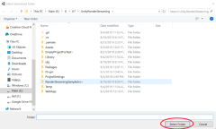
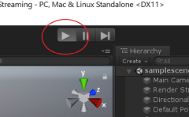

# Tutorial

Currently, there are two samples:

### HDRP sample

Importing this sample will automatically install and setup our HDRP sample assets along with the [HDRP](https://docs.unity3d.com/Packages/com.unity.render-pipelines.high-definition@latest) *(com.unity.render-pipelines.high-definition)* package.

### URP sample

Importing this sample will automatically install and setup our URP sample assets along with the [URP](https://docs.unity3d.com/Packages/com.unity.render-pipelines.universal@latest) *(com.unity.render-pipelines.universal)* package.

## Simple Tutorial on Windows

Open an existing or create a new project
Click on the `Window` Menu and open `Package Manager`. Then, click on `Advanced` and make sure `Show preview packages` is checked

Make sure to search `All packages`, and type `RenderStreaming` in the text box.

Click `Install` on the bottom right.

If an input system dialog box appears, click `Yes`

Click on `Import in project` to import the HDRP sample.
   This will also automatically install the HDRP package *(com.unity.render-pipelines.high-definition)*.

When this `Import Unity Package` dialog box appears, click `Import` to import all assets.

After all the import process has been finished, open `Assets/SimpleScene` in the Project View.

Click on `Edit/Render Streaming/Download web app` menu item to download [our web server](https://github.com/Unity-Technologies/UnityRenderStreaming/releases).

When the select download folder window appears, click on `Select Folder` to download the file to the default folder

After the download is finished and a new explorer window is opened, click on `webserver.exe` to start 
Unity RenderStreaming web server.

Enter play mode in Unity

Open your browser and type `localhost` on the URL bar. Then click on the play button in the middle. 
The view in Unity should then appear on your browser.

