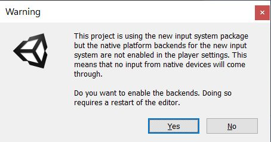
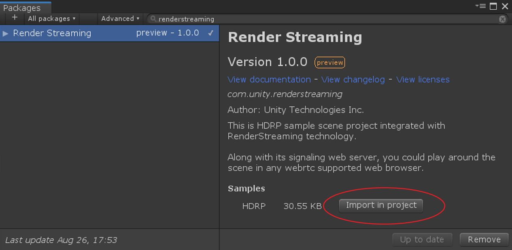
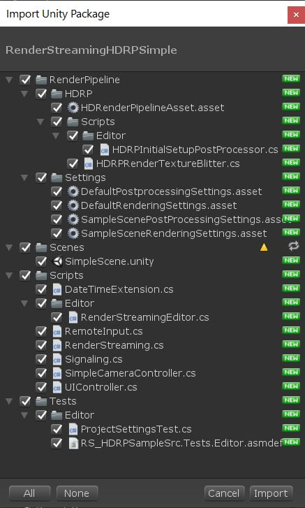
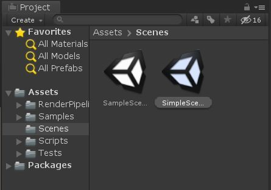

# com.unity.renderstreaming

- [Japanese](./jp/index.md)

This package contains public APIs and project samples that are built on top of our [**Unity Render Streaming**](../../com.unity.template.renderstreaming/Documentation~/index.md).

Currently, there is one sample:

- HDRP. 
  > Importing this sample will automatically install and setup our HDRP sample assets along with the HDRP *(com.unity.render-pipelines.high-definition)* package.

### Tutorial

1.  Open an existing or create a new project
2.  Click on the `Window` Menu and open `Package Manager`. Then, click on `Advanced` and make sure `Show preview packages` is checked

3.  Make sure to search `All packages`, and type `RenderStreaming` in the text box.

4. Click `Install` on the bottom right.

5. When presented with the input system dialog box, click on `Yes`

6. Click on `Import in project` to import the HDRP sample.
   This will also automatically install the HDRP package *(com.unity.render-pipelines.high-definition)*.

7. When presented with this dialog box, click `Import` to import all assets.

8. After all the import process has been finished, open `Assets/SimpleScene` in the Project View.

9. The project setup is done. The next steps would be to launch a webserver as described on
[github](https://github.com/Unity-Technologies/UnityRenderStreaming/blob/release/1.1.0/Packages/com.unity.template.renderstreaming/Documentation~/en/tutorial.md)

