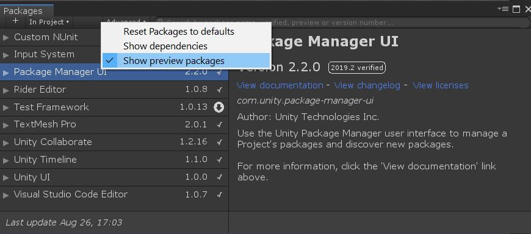
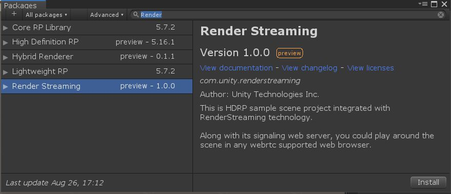

# com.unity.renderstreaming

- [Japanese](./jp/index.md)

This package contains public APIs and project samples that are built on top of our [**Unity Render Streaming**](../../com.unity.template.renderstreaming/Documentation~/index.md).

Currently, there is one sample:

- HDRP. 
  > Importing this sample will automatically install and setup our HDRP sample assets along with the HDRP *(com.unity.render-pipelines.high-definition)* package.

### Tutorial

1.  Open an existing or create a new project
2.  Open `Package Manager`, click on `Advanced` and make sure `Show preview packages` is checked

3.  Make sure to search `All packages` on the top left, and type `RenderStreaming` in the text box.

- com.unity.template.renderstreaming.tgz

Tutorial  

1. 任意のプロジェクトを開く

2.  `com.unity.renderstreaming` と `com.unity.webrtc` をPackage Manager からインストールする

3. `com.unity.renderstreaming` の `Import in project` を実行する

4. `Import Unity Package` のダイアログが表示されるので `Import` を押す

5. `Scenes/SimpleScene.unity` を開く
