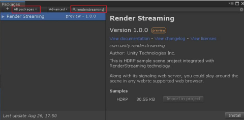
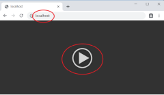

# com.unity.renderstreaming

- [Japanese](./jp/index.md)

This package contains public APIs and project samples that are built on top of our [**Unity Render Streaming**](../../com.unity.template.renderstreaming/Documentation~/index.md).

Currently, there is one sample:

- HDRP. 
  > Importing this sample will automatically install and setup our HDRP sample assets along with the HDRP *(com.unity.render-pipelines.high-definition)* package.

## Simple Tutorial on Windows

1.  Open an existing or create a new project
2.  Click on the `Window` Menu and open `Package Manager`. Then, click on `Advanced` and make sure `Show preview packages` is checked

	

3.  Make sure to search `All packages`, and type `RenderStreaming` in the text box.

	

4. Click `Install` on the bottom right.

5. If an input system dialog box appears, click `Yes`

	

6. Click on `Import in project` to import the HDRP sample.
   This will also automatically install the HDRP package *(com.unity.render-pipelines.high-definition)*.

	

7. When this `Import Unity Package` dialog box appears, click `Import` to import all assets.

	

8. After all the import process has been finished, open `Assets/SimpleScene` in the Project View.

	

9. Click on `Edit/Render Streaming/Download web app` menu item to download our web server

	

10. When the select download folder window appears, click on `Select Folder` to download the file to the default folder

	

11. After the download is finished and a new explorer window is opened, click on `webserver.exe` to start 
Unity RenderStreaming web server.

	

12. Enter play mode in Unity

	

13. Open your browser and type `localhost` on the URL bar. Then click on the play button in the middle. 
The view in Unity should then appear on your browser.

	

