# HTTPSの証明書の設定

### 前提条件

#### Windows

#### Chocolatey

Chocolatey は Windows で動作するパッケージマネージャーです。こちらの [リンク](https://chocolatey.org/install) からインストールできます。

#### OpenSSL

**OpenSSL** は堅牢で商用レベルでの利用にも耐えられる、機能豊富な Transport Layer Security（TLS） および Secure Sockets Layer（SSL）プロトコルのツールキットです。以下のコマンドでインストールできます。

```terminal
choco install openssl.light
```

### 手順 1：秘密鍵を作成する

次のコマンドを実行します：

```terminal
"C:\Program Files\OpenSSL\bin\openssl.exe" genrsa -des3 -out rootSSL.key 2048
```

パスワードを入力します：

```terminal
Enter pass phrase for rootSSL.key:
```

パスワードを確認します

```terminal
Verifying - Enter pass phrase for rootSSL.key:
```

### 手順 2：証明書ファイルを作成する

次のコマンドを実行します：

```terminal
"C:\Program Files\OpenSSL\bin\openssl.exe" req -x509 -new -nodes -key rootSSL.key -sha256 -days 1024 -out rootSSL.pem
```

パスワードを入力します：

```terminal
Enter pass phrase for rootSSL.key:
```

ソフトウェアを利用する国の 2 文字の国コードを入力します：

```terminal
Country Name (2 letter code) [AU]:CA
```

ソフトウェアを利用する場所（州、都道府県など）の名称を入力します：

```terminal
State or Province Name (full name) [Some-State]:Quebec
```

ソフトウェアを利用する地域（市区町村、郡など）の名称を入力します：

```terminal
Locality Name (eg, city) []:montreal
```

ソフトウェアを利用する組織の名称を入力します：

```terminal
Organization Name (eg, company) [Internet Widgits Pty Ltd]:Unity
```

組織内で所属しているビジネスユニットの名称を入力します：

```terminal
Organizational Unit Name (eg, section) []:Verticals
```

ソフトウェアを利用するコンピューターの「完全修飾ドメイン名（FQDN）」または利用者自身のお名前を入力します：

```terminal
Common Name (e.g. server FQDN or YOUR name) []:Tony
```

メールアドレスを入力します：

```terminal
Email Address []:anthonyma@unity3d.com
```

### 手順 3：Windows で認証局（CA）を信頼する

1. `マイクロソフト管理コンソール（mmc.exe）`を検索して起動します

    

2. `ファイル > スナップインの追加と削除...` を選択します

    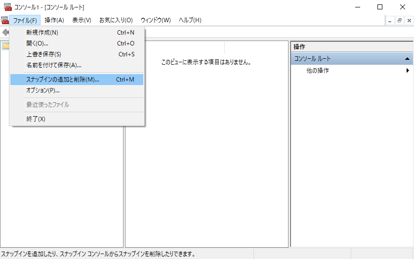

3. `証明書` をクリックして、次に `追加 >` をクリックします

    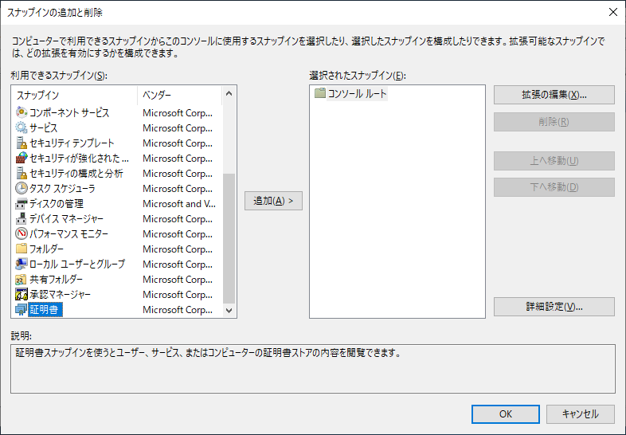

4. `コンピューター アカウント` を選択して `次へ >` をクリックします

    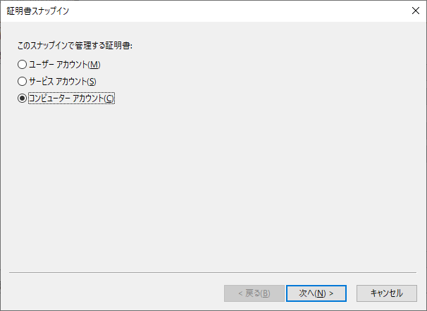

5. `ローカル コンピューター (このコンソールを実行しているコンピューター)` を選択して `完了` をクリックします

    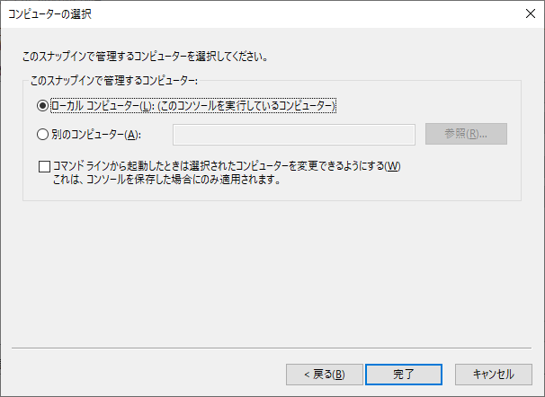

6. 証明書が追加されたことを確認して、`スナップインの追加と削除` ウィンドウの `OK` をクリックします

    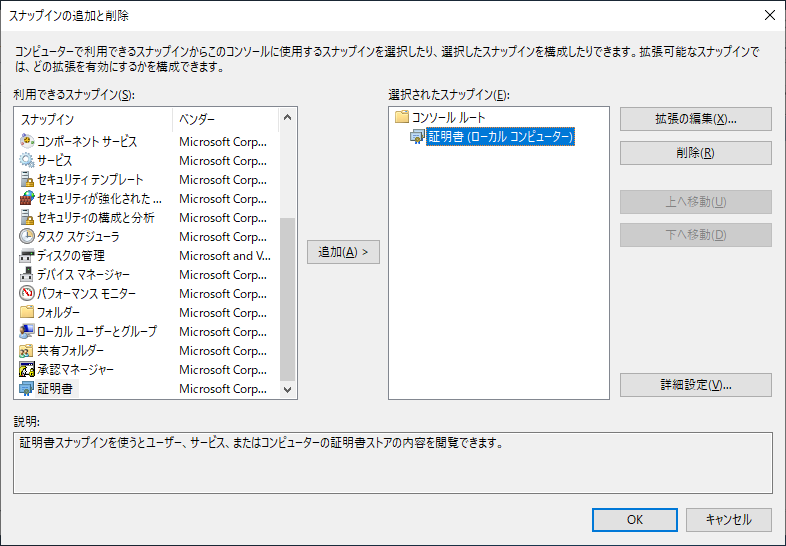

7. `コンソール 1 - [コンソール ルート]` と表示されているウィンドウの左側で、`コンソール ルート > 証明書 (ローカル コンピューター)` を展開します

    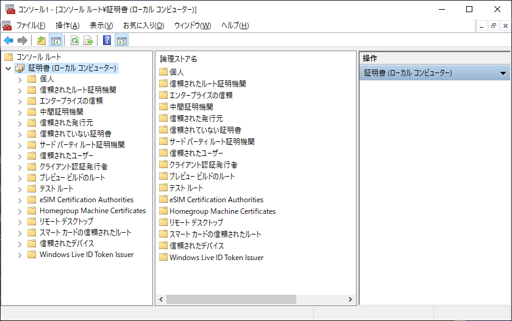

8. `信頼されたルート証明機関` を選択して、`証明書` を `右クリック` し、`すべてのタスク > インポート...` を選択します

    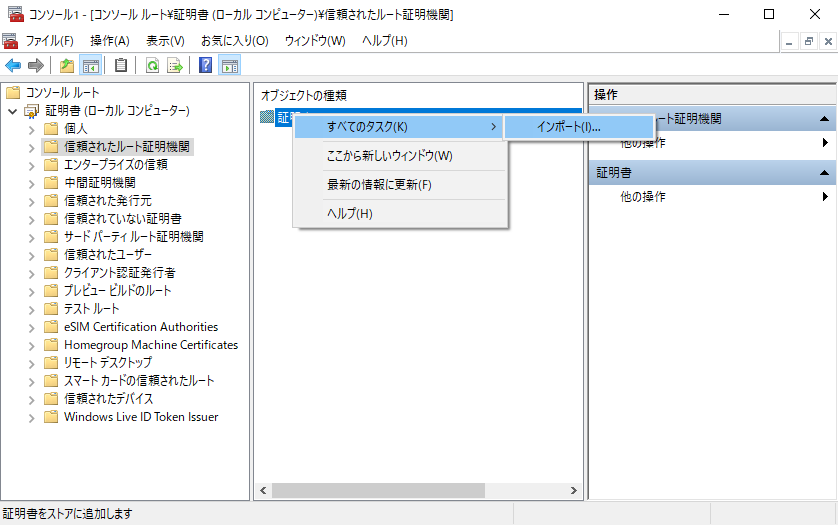

9. `証明書のインポート ウィザード` ウィンドウが表示されるので `次へ` をクリックします

    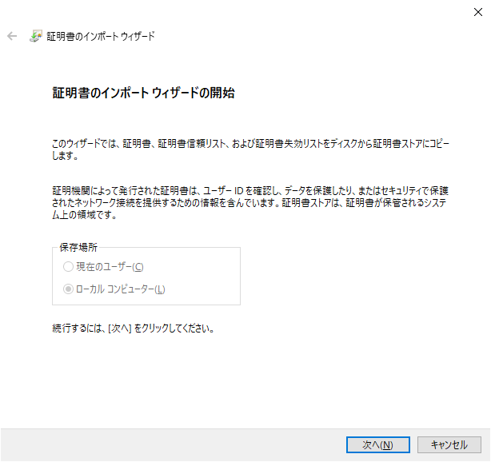

10. 手順 2：証明書ファイルを作成する で作成した `rootSSL.pem` ファイルを指定して、`次へ` をクリックします

    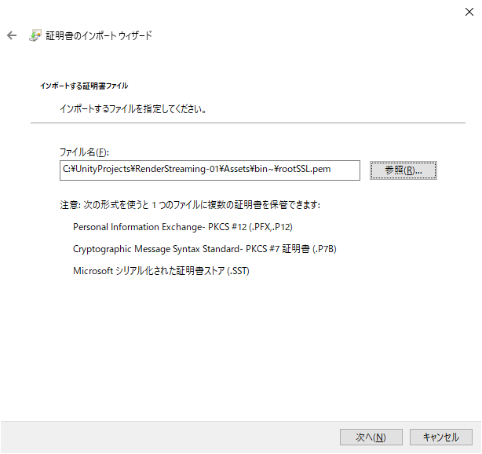

11. `証明書をすべて次のストアに配置する` を選択して、`信頼されたルート証明期間` が `証明書ストア:` フィールドの値に設定されていることを確認して、`次へ` をクリックします。

    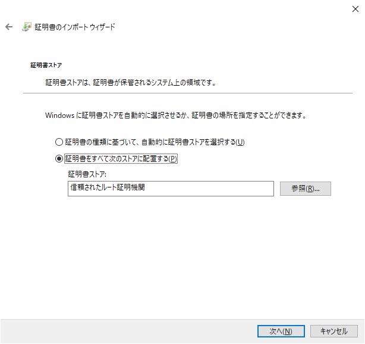

12. `完了` をクリックします。

    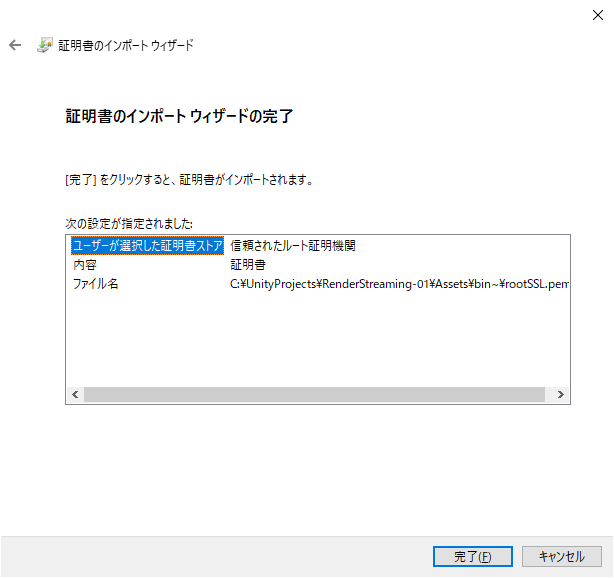

### 手順 4：ローカルドメインサイトを作成する

1. `127.0.0.1 client-1.local` を `C:\Windows\System32\drivers\etc\hosts` ファイルに追加します。

```hosts
# Copyright (c) 1993-2009 Microsoft Corp.
#
# This is a sample HOSTS file used by Microsoft TCP/IP for Windows.
#
# This file contains the mappings of IP addresses to host names. Each
# entry should be kept on an individual line. The IP address should
# be placed in the first column followed by the corresponding host name.
# The IP address and the host name should be separated by at least one
# space.
#
# Additionally, comments (such as these) may be inserted on individual
# lines or following the machine name denoted by a '#' symbol.
#
# For example:
#
#      102.54.94.97     rhino.acme.com          # source server
#       38.25.63.10     x.acme.com              # x client host

# localhost name resolution is handled within DNS itself.
#   127.0.0.1       localhost
#   ::1             localhost

127.0.0.1 client-1.local
# End of section

```

### 手順 5：秘密鍵（`client-1.local.key`）と、新しく作ったドメイン用の認証リクエスト（`client-1.local.csr`）を作成する

次のコマンドを実行します。なお、下記のフィールドの値は [手順 1：秘密鍵を作成する](#Step-1:-Create-a-Private-Key) で使った値と同じであるとします。

* C=CA （国）
* ST=Quebec （州）
* L=montreal （地域）
* O=Unity （組織）
* OU=Verticals （ビジネスユニット）
* CN=Tony （ユーザー名）
* email<span>Address=anthonyma@unity3d.</span>com （メールアドレス）

```terminal
"C:\Program Files\OpenSSL\bin\openssl.exe" req -new -sha256 -nodes -out client-1.local.csr -newkey rsa:2048 -keyout client-1.local.key -subj "/C=CA/ST=Quebec/L=montreal/O=Unity/OU=Verticals/CN=Tony/emailAddress=anthonyma@unity3d.com"
```

### 手順 6：新しい証明書（`client-1.local.crt`）を発行する

次のコマンドを実行します：

```terminal
"C:\Program Files\OpenSSL\bin\openssl.exe" x509 -req -in client-1.local.csr -CA rootSSL.pem -CAkey rootSSL.key -CAcreateserial -out client-1.local.crt -days 500 -sha256 -extensions "authorityKeyIdentifier=keyid,issuer\n basicConstraints=CA:FALSE\n keyUsage = digitalSignature, nonRepudiation, keyEncipherment, dataEncipherment\n  subjectAltName=DNS:client-1.local"
```

パスワードを入力します：

```terminal
Enter pass phrase for rootSSL.key:
```

### 手順 7：`webserver.exe` を実行する

次のコマンドを実行します：

```terminal
.\webserver.exe -s -p 443 -k client-1.local.key  -c client-1.local.crt
```
