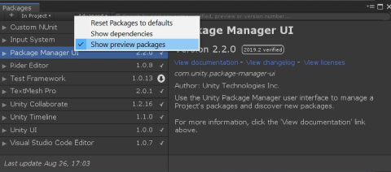
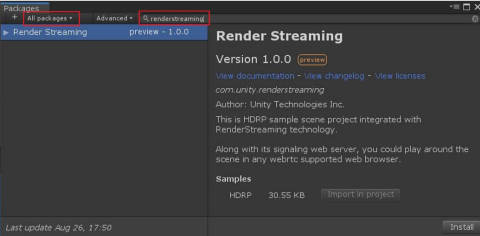
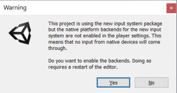
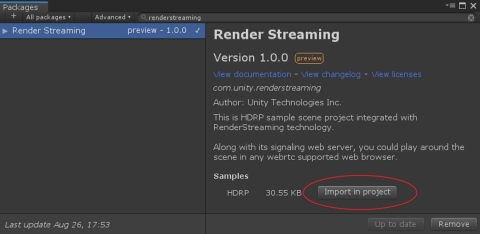
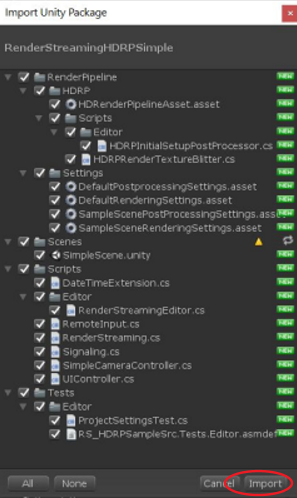
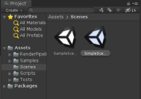
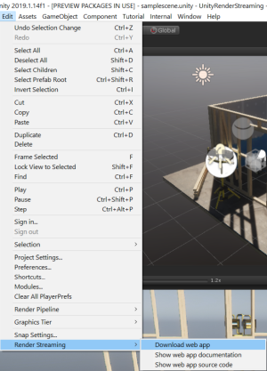
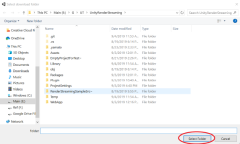
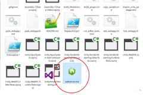
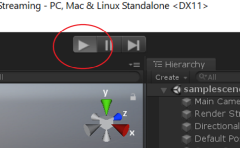

# com.unity.renderstreaming

- [English](../index.md)

このパッケージには Unity の [**Unity Render Streaming**](../../../com.unity.template.renderstreaming/Documentation~/index.md) を基に作られた公開 API とサンプルプロジェクトが含まれます。

現在、1 つのサンプルがあります。

- HDRP. 
  > このサンプルをインポートすると、HDRP *(com.unity.render-pipelines.high-definition)* パッケージと Unity が提供している HDRP サンプルアセットのインストールと設定が自動的に行われます。

## Windows 向けの簡単なチュートリアル

1. 既存のプロジェクトを開きます。または、新しいプロジェクトを作成します。
2. `Window` メニューをクリックし、`Package Manager` を開きます。次に、`Advanced` をクリックして `Show preview packages` にチェックを入れます。

3. 検索のモードを `All packages` にして、テキストボックスに `RenderStreaming` と入力します。

4. 右下の `Install` をクリックします。

5. 入力システムに関するダイアログボックスが表示された場合は、`Yes` をクリックします。

6. `Import in project` をクリックして HDRP サンプルをインポートします。
この操作によって、HDRP パッケージ *(com.unity.render-pipelines.high-definition)* が自動的にインストールされます。

7. 下図の `Import Unity Package` ダイアログボックスが表示されたら、`Import` をクリックしてすべてのアセットをインポートします。

8. すべてのインポートプロセスが終わった後、Project ビューから `Assets/SimpleScene` を開きます。

9. `Edit/Render Streaming/Download web app` メニューアイテムをクリックして、あらかじめ用意されているウェブサーバーをダウンロードします。

10. ダウンロード先フォルダーを選択するウィンドウが表示されたら、`Select Folder` をクリックしてデフォルトのフォルダーにファイルをダウンロードします。

11. ダウンロードが終了して、エクスプローラーの新しいウィンドウが開いたら、`webserver.exe` をクリックして Unity RenderStreaming ウェブサーバーを起動します。

12. Unity で再生モードに入ります。

13. ブラウザーを立ち上げ、URL バーに `localhost` と入力し、中央に表示されている再生ボタンをクリックします。
クリックすると、Unity のビューがブラウザーに表示されます。

