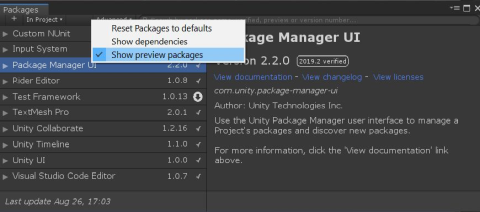
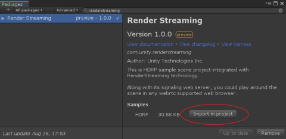

# チュートリアル

このパッケージには以下の2つのサンプルが含まれています。

### HDRP サンプル

このサンプルをインポートすると、[HDRP](https://docs.unity3d.com/Packages/com.unity.render-pipelines.high-definition@latest) (*com.unity.render-pipelines.high-definition*) パッケージと Unity が提供している HDRP サンプルアセットのインストールと設定が自動的に行われます。

### URP サンプル

このサンプルをインポートすると、[URP](https://docs.unity3d.com/Packages/com.unity.render-pipelines.universal@latest) (*com.unity.render-pipelines.universal*) パッケージと Unity が提供している URP サンプルアセットのインストールと設定が自動的に行われます。

## Windows 向けの簡単なチュートリアル

既存のプロジェクトを開きます。または、新しいプロジェクトを作成します。
`Window` メニューをクリックし、`Package Manager` を開きます。次に、`Advanced` をクリックして `Show preview packages` にチェックを入れます。

検索のモードを `All packages` にして、テキストボックスに `RenderStreaming` と入力します。

右下の `Install` をクリックします。

入力システムに関するダイアログボックスが表示された場合は、`Yes` をクリックします。

`Import in project` をクリックして HDRP サンプルをインポートします。
この操作によって、HDRP パッケージ *(com.unity.render-pipelines.high-definition)* が自動的にインストールされます。

下図の `Import Unity Package` ダイアログボックスが表示されたら、`Import` をクリックしてすべてのアセットをインポートします。

すべてのインポートプロセスが終わった後、Project ビューから `Assets/SimpleScene` を開きます。

`Edit/Render Streaming/Download web app` メニューアイテムをクリックして、あらかじめ用意されている[ウェブサーバー](https://github.com/Unity-Technologies/UnityRenderStreaming/releases)をダウンロードします。

ダウンロード先フォルダーを選択するウィンドウが表示されたら、`Select Folder` をクリックしてデフォルトのフォルダーにファイルをダウンロードします。

ダウンロードが終了して、エクスプローラーの新しいウィンドウが開いたら、`webserver.exe` をクリックして Unity RenderStreaming ウェブサーバーを起動します。

Unity で再生モードに入ります。

ブラウザーを立ち上げ、URL バーに `localhost` と入力し、中央に表示されている再生ボタンをクリックします。
クリックすると、Unity のビューがブラウザーに表示されます。

