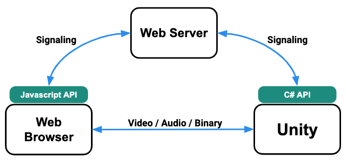
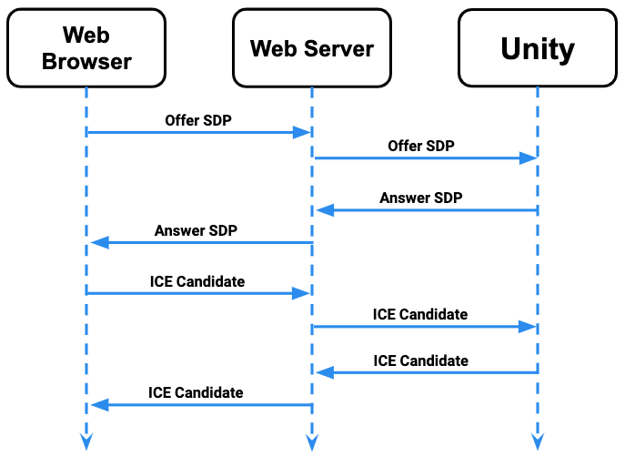
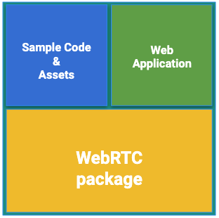

# Render Streaming Overview

The following is an explanation the general concepts of the Render Streaming system. 

### System Structure

The Render Streaming system consists of the following 3 components

- Unity (Editor or Application)
- Web server
- Web browser 

In Render Streaming a P2P network is created between **Unity** and the **Web browser**, and this network sends data via UDP/IP. The **Web server** enables communication between the Web browser and Unity. This communication is called signaling. 

> [!NOTE]
> Currently does not support the following features.
>
> - Streaming video from the browser to Unity
> - Streaming audio from the browser to Unity

### The Signaling Process

The following is an explanation of how signaling works. 

 

1. Web browser sends **Offer SDP** to the Web server.
2. Unity checks the Web server for unprocessed **Offer SDPs** and receives any found.
3. Unity sends **Answer SDP** to the Web server.
4. Web browser checks the Web server for unprocessed **Answer SDPs** and receives any found.
5. Web browser sends **ICE Candidate** to the Web server.
6. Unity checks the Web server for unprocessed **ICE Candidates** and receives any found. 
7. Unity sends **ICE Candidate**to the Web server.
8. Web browser checks the Web server for unprocessed **ICE Candidate** and receives any found. 

### Package Structure 

The Render Steraming package includes the following.

- WebRTC package
- Sample code / assets
- Web application

### WebRTC Package

This provides the WebRTC C# API. See the WebRTC package documentation for details on the API.

### Sample Code / Assets

This is a template project containing an HDRP template sample which also incorporates Render Streaming.

### Web Application

Includes a client side and server side sample. Also provides the signaling server features. For details, see the [documentation](webserver.md).
