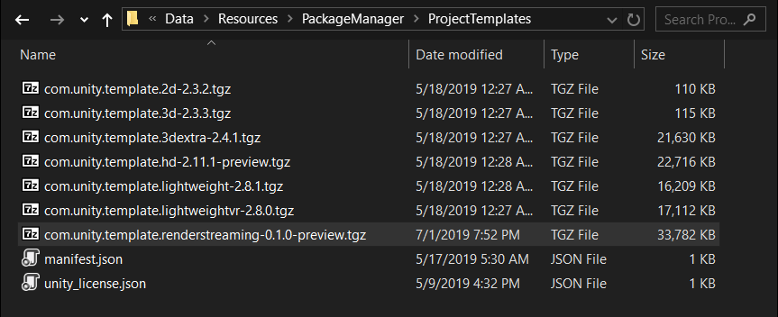
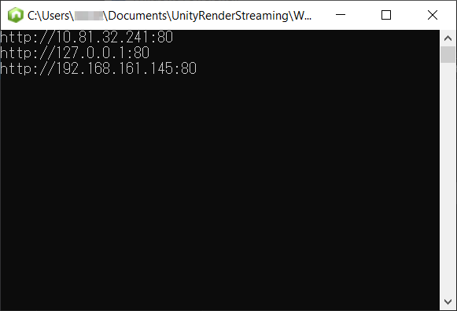

# Getting Started

### Download the Package

There are 2 ways to get started with Render Streaming.

- Download the latest source code from the [Github repository](https://github.com/Unity-Technologies/UnityRenderStreaming)
- Download the package from the [Github Release](https://github.com/Unity-Technologies/UnityRenderStreaming/releases) 

If you decide to download the package, please download these 2 packages. 

- `com.unity.renderstreaming-x.x.x-preview.tgz`
- `com.unity.template.renderstreaming-x.x.x-preview.tgz`

Additionally, you download a package from the [Github Release](https://github.com/Unity-Technologies/com.unity.webrtc/releases) page of the `com.unity.webrtc` repository.

- `com.unity.webrtc-x.x.x-preview.tgz`

> [!NOTE]
> < This process made for temporary use. It is not needed if these packages are registered to PackageManager in the future. >

Put the packages in a dedicated folder in order to use them as a project template.

### Project Template (Experimental)

The project template can be selected as a template when creating a new Unity project. 


When using the template package, put the 2 tgz files in the following folders. 

Move `com.unity.template.renderstreaming-x.x.x-preview.tgz` to this folder

```
 <Unity Editor Root>/Data/Resources/PackageManager/ProjectTemplates
```



Move `com.unity.webrtc-x.x.x-preview.tgz` and `com.unity.renderstreaming-x.x.x-preview.tgz` to this folder

```&lt;Unity Editor Root&gt;/Data/Resources/PackageManager/Editor
<Unity Editor Root>/Data/Resources/PackageManager/Editor
```


After moving the packages, open the Unity Hub and create a new project. Confirm that `Render Streaming` has been added as a template. 

### Launch the Web Server

The web server's .exe file is located under `Assets/~bin/`. Running the file will bring up the command prompt. 


Confirm that the following log displays in the command prompt. The web server's address should be displayed. Details on web  server command options can be found on the [Web server](webserver_EN.md) page.



The web server's source code is located in the `WebApp` folder. Additionally, [Node.js](https://nodejs.org) must be installed in order to run the source code. Download the installer from the website.

### Unity Settings

Open the `Assets/Scenes/samplescene.unity` sample scene.


Select `RenderStreaming` in the Hierarchy. Check the `Render Streaming`components in the Inspector. 


Set the address of the web server you just activated under the `URL Signaling` parameter. For details on the various settings in the Inspector, see the Render Streaming class [reference](class-renderstreaming.md). 

### Accessing the Web Page

Open one of the [supported browsers]() from the list. 
Access the Web server's address. The following web page will be displayed. 


If this doesn't happen, it's possible that the browser version is too old. Be sure to install the latest version. 
