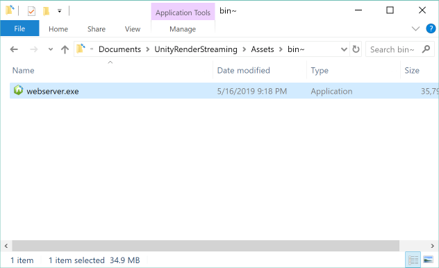
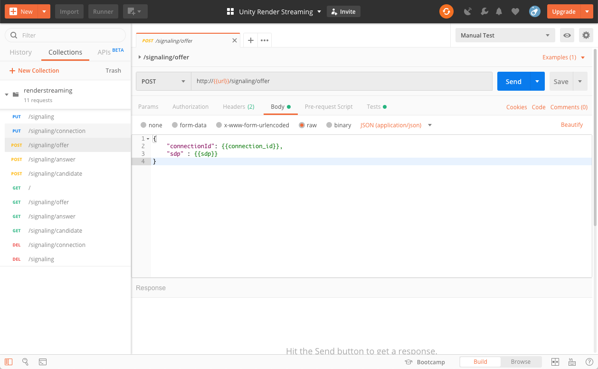

## The Web Application

The **Web application** 

- handles signaling between Unity and the Web browser
- is the location of the Web page 


## The Web Client


## The Web Server

The Web server is distributed as a binary using [pkg](https://www.npmjs.com/package/pkg) in order to lessen the effort required to set up the environment. The .exe file is located in the `Assets/bin~/` folder.



### Command Options

|Option|Details|Default|
|-------|-----|-------|
|-h --help|Show the help menu||
|-p —port \<number\>|Set the port number|80|
|-s --secure|Enable https||
|-k —keyfile \<path\>|Designate the private key file to use with https|server.key|
|-c —certfile \<path\>|Designate the certification file to use with https|server.cert|

### Command Examples

This command will run the web application as http. Port 80 is used.

```shell
.\webserver
```

This command will run the web application as https. Port 443 is used.

```shell
.\webserver -s -p 443
```

This command will show the help menu. 

```shell
.\webserver -h
```

### Editing the Web Application

The Web application's source code is located in the [WebApp](../WebApp) folder. [Node.js](https://nodejs.org/) must also be installed in order to use the source code.

This is how to use **Node.js** to open the command prompt.

```shell
npm run start
```

This command displays the help menu. 

```shell
npm run start -- -h
```

This command will use `ts-node` to activate the server.

```shell
npm run dev
```

### Checking the Web API

Render Streaming signaling uses a simple Web API. The API can be checked in [Postman](https://www.getpostman.com/).

Import `WebApp/test/renderstreaming.postman_collection.json` through Postman to view a summary of the API. Additionally, API operation tests can be run while the Web server is active.


