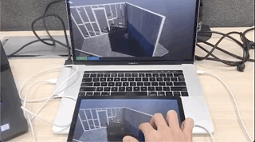

# Unity Render Streaming

- [Japanese](jp/index.md)

**Unity Render Streaming** is a solution that provides Unity's high definition rendering abilities via browser. It's designed to meet the needs of tasks like viewing car configurators or architectural models on mobile devices.  
This solution's streaming technology takes advantage of [WebRTC](https://webrtc.org/),  and through customization developers can create their own unique solutions.

## Guide

* [Overview](./en/overview.md)
* [Tutorial](./en/tutorial.md)
* [Input](./en/input.md)
* [Web Server](./en/webserver.md)
* [Render Streaming Reference](en/class-renderstreaming.md)
* [FAQ](./en/faq.md)

## Requirements

This version of Render Streaming is compatible with the following versions of the Unity Editor:

- 2019.1 and later (recommended)

> [!NOTE]
> <`Unity 2018.3` is not supported.>

Currently the software only supports `windows64`.

Graphics API version is only supports `Direct3D11`.

### Browsers

- Desktop Chrome
- Desktop Firefox
- Desktop Safari
- Android Chrome
- iOS Safari
