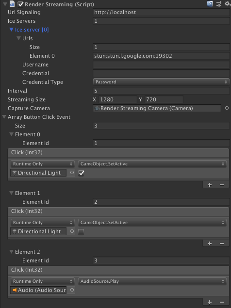

# Render Streaming クラス

**Render Streaming** は以下の機能を含みます。

- シグナリングサーバーとの通信
- カメラからの入力をストリームとして送信
- ブラウザからの入力とイベントとの関連付け

## プロパティ

| パラメーター                | 説明                                              | デフォルト                          |
| ---------------------------- | ------------------------------------------------------------ | ------------------------------- |
| **URL Signaling**            | シグナリングサーバーの URL を指定します                         | http://localhost                |
| **Ice Servers**              | STUN/TURN サーバーをリストで指定します                         |                                 |
| *Urls*                       | STUN/TURN サーバーの URL を指定します                            | [stun:stun.l.google.com:19302\] |
| *Username*                   | TURN サーバーを利用するときに使用するユーザ名 |                                 |
| *Credencial*                 | TURN サーバーを利用するときにサーバーにログインするときに使用する資格情報 |                                 |
| *Credencial Type*            | TURN サーバーを利用するときにログイン時に使用される資格情報の種類を指定します | Password                        |
| **Interval**                 | シグナリングサーバーへのポーリング頻度を秒単位で指定します     | 5                               |
| **Streaming Size**           | ストリーミングに使用するフレームバッファのサイズです   | 1280, 720                       |
| **Capture Camera**           | ストリーミング用のカメラを指定します                           |                                 |
| **Array Button Click Event** | ブラウザー上のボタンクリックイベントを登録します                |                                 |
| *Element Id*                 | ブラウザーから送られる ID を指定します |                                 |
| *Click*                      | ボタンクリックイベントを登録します     |                                 |