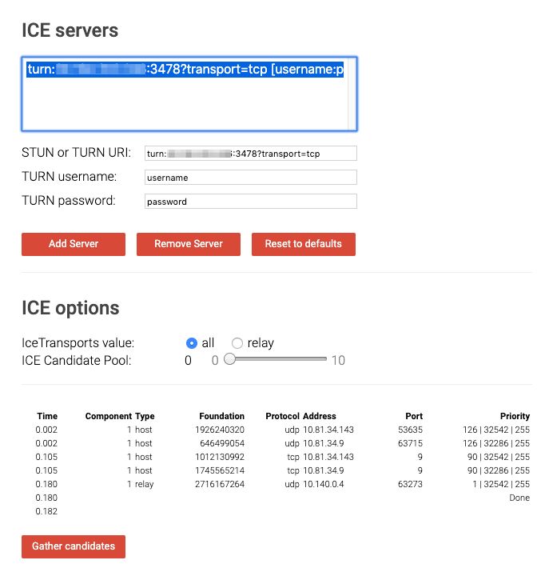

# TURN サーバとの連携

Render Streaming でストリーミングができない場合、はじめに問題の切り分けをする必要があります。まずは [トラブルに関する質問](faq.md) を参照してください。もしファイアウォールの問題であった場合は、ファイアウォールの設定を変更するか、 **TURN サーバ** を利用する必要があります。

**TURN（Traversal Using Relay around NAT）**とは、NAT やファイアウォールを超えて通信を行うための通信プロトコルです。TURN を利用するには、NAT の外側に **TURN サーバ** を設置する必要があります。

このドキュメントでは、Render Streaming で TURN サーバと連携する方法について説明します。TURN サーバを実現するソフトウェアとして [coturn](https://github.com/coturn/coturn) を利用します。coturn は TURN サーバのオープンソース実装です。

## インスタンスの設定

coturn を GCP インスタンス上で実行する方法について説明します。

 `apt` コマンドで coturn をインストールするため、インスタンスイメージには**ubuntu-minimal-1604-xenial-v20190628** を利用しています。coturn がサポートしているディストリビューションであれば問題ありません。サポートの詳細は coturn の [README](https://github.com/coturn/coturn) を確認してください。

### Firewall rules の設定

TURN サーバが利用するポートを公開する必要があるので、ファイアウォールの設定を追加します。

| Protocol | PORT                   |
| -------- | ---------------------- |
| TCP      | 32355-65535, 3478-3479 |
| UDP      | 32355-65535, 3478-3479 |


### coturn のインストール

GCPインスタンスに `ssh` でログインしてください。 
`coturn` をインストールします。

```shell
sudo apt install coturn
```

coturn を TURN サーバとして利用するため、デーモンで起動するときの設定を変更します。
以下のファイルを編集します。

```shell
sudo vim /etc/default/coturn
```

以下の行を追加します。

```
TURNSERVER_ENABLED=1
```

次に、coturn の設定ファイルを編集します。

```shell
sudo vim /etc/turnserver.conf
```

以下の行のコメントを外して、各自の内容に応じて記述します。

```shell
# 外部のピアに教える TURN サーバーが待ち構えるIPアドレス
external-ip=10.140.0.4

# 認証を有効化する
lt-cred-mech

# ユーザ名とパスワードを指定
user=username:password

# レルムの設定
realm=yourcompany.com

# ログファイルの設定
log-file=/var/tmp/turn.log
```

設定完了後、coturn サービスを再起動します。

```shell
sudo systemctl restart coturn
```

### 導通確認

coturn の設定を完了したら、TURN サーバの動作を確認するためログを監視します。

```
tail -f /var/tmp/turn_xxxx-xx-xx.log
```

[webrtc サンプル](https://webrtc.github.io/samples/src/content/peerconnection/trickle-ice/) を利用して TURN サーバへの接続を行います。以下のように設定して `Add Server` ボタンを押します。

| Parameter        | Example                               |
| ---------------- | ------------------------------------- |
| STUN or TURN URI | `turn:xx.xx.xx.xx:3478?transport=tcp` |
| TURN username    | username                              |
| TURN password    | password                              |



`Gather candidates` ボタンを押すと、リストに通信経路候補が表示されます。TURN サーバ側にもログが出力されていることを確認してください。 

### ブラウザ側の変更

ブラウザ側は `video-player.js` の `config.iceServers` の設定を変更します。

```javascript
config.iceServers = [{
  	urls: ['stun:stun.l.google.com:19302']
	}, {
    urls: ['turn:xx.xx.xx.xx:3478?transport=tcp'], 
   	username: 'username', 
   	credential: 'password'
  }
];
```

### Unity 側の変更

`Render Streaming` インスペクタの `Ice Servers` に TURN サーバの設定を追加してください。


