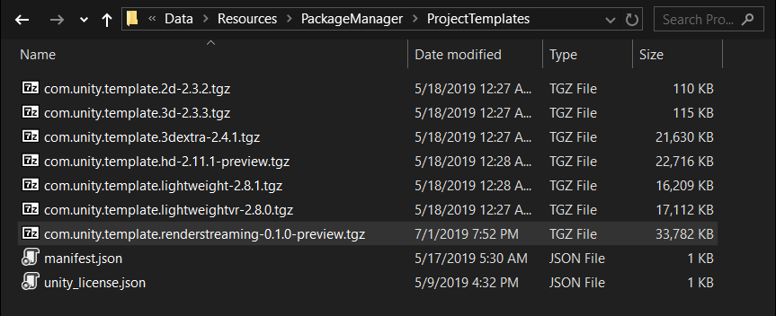
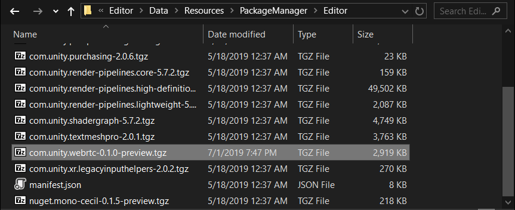
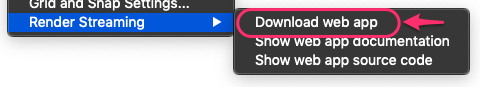
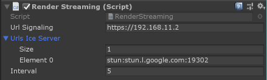
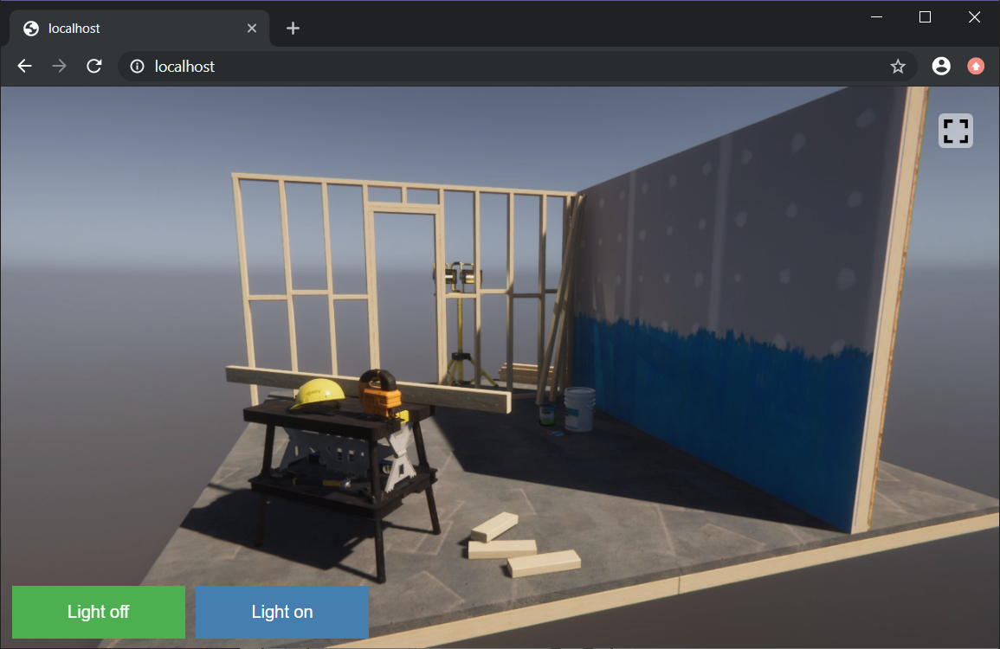

# 利用を開始するには

### パッケージのダウンロード

Render Streaming の利用を開始するためには、[Github Release](https://github.com/Unity-Technologies/UnityRenderStreaming/releases) からパッケージをダウンロードします。ダウンロードしたパッケージを所定のフォルダに移動することで、プロジェクトテンプレートとして利用することが可能です。

> [!NOTE]
> < 既存のプロジェクトに対して Render Streaming を組み込みたい場合は、プロジェクトテンプレートではなく、 [こちら](../../../com.unity.renderstreaming/Documentation~/ja/index.md) を参考にしてください。>

[Github Release](https://github.com/Unity-Technologies/UnityRenderStreaming/releases) から2つのパッケージをダウンロードします。

- `com.unity.renderstreaming-x.x.x-preview.tgz`
- `com.unity.template.renderstreaming-x.x.x-preview.tgz`

もう1つのパッケージは `com.unity.webrtc` リポジトリの [Github Release](https://github.com/Unity-Technologies/com.unity.webrtc/releases) からダウンロードします。 

- `com.unity.webrtc-x.x.x-preview.tgz`

> [!NOTE]
> < これらの作業は暫定的なものです。将来的にはこれらのパッケージは PackageManager に登録される予定です。PackageManager から直接ダウンロード可能になれば、手動でのパッケージインストールは不要になります。 >

### プロジェクトテンプレート (Experimental)

プロジェクトテンプレートとは、Unity で新規プロジェクトを作成するときに設定済みの Unity プロジェクトを選択できる機能です。


テンプレートパッケージを利用する際は、 tgz ファイルをそれぞれ以下のフォルダに配置します。

`com.unity.template.renderstreaming-x.x.x-preview.tgz` を以下のフォルダに移動

```
 <Unity Editor Root>/Data/Resources/PackageManager/ProjectTemplates
```



`com.unity.webrtc-x.x.x-preview.tgz` と`com.unity.renderstreaming-x.x.x-preview.tgz`を以下のフォルダに移動

```&lt;Unity Editor Root&gt;/Data/Resources/PackageManager/Editor
<Unity Editor Root>/Data/Resources/PackageManager/Editor
```



パッケージを移動後、Unity Hub を起動し新規プロジェクトを作成します。テンプレートに `Render Streaming` が追加されていることを確認してください。

### Web サーバの起動

Webサーバの実行ファイルはメニューからダウンロードします。メニューから`Edit > Unity Render Streaming > Download Web app` を選択してください。



メニューを実行すると、ダウンロードが開始されます。ダウンロードが完了すると、ダウンロード先のフォルダ指定ダイアログが表示されます。ダウンロード先フォルダを指定すると、フォルダウィンドウが表示されます。


`webserver.exe` を実行すると、コマンドプロンプトが起動します。コマンドプロンプトに以下のようなログが表示されていることを確認してください。 Web サーバのアドレスが表示されます。Web サーバのコマンドオプションの詳細は [Web サーバ](webserver.md)のページを参照してください。


Webサーバのソースコードは [WebApp](WebApp) に配置しています。なお、ソースコードを実行するためには [Node.js](https://nodejs.org) をインストールする必要があります。公式サイトからインストーラをダウンロードしてインストールしてください。

### Unity 側の設定

サンプルシーン `Assets/Scenes/samplescene.unity` を開きます。


ヒエラルキービューの `RenderStreaming` を選択してください。インスペクタビューの `Render Streaming` コンポーネントを確認してください。



`URL Signaling` パラメータには、先ほど起動した Web サーバのアドレスを指定してください。インスペクタの各設定については Render Streaming クラスの[リファレンス](class-renderstreaming.md)を参照してください。

### Webページへのアクセス

[対応ブラウザ]()のリストに含まれているブラウザを起動します。
Web サーバのアドレスにアクセスしてください。以下のようにウェブページが表示されます。



### トラブルシューティング

[よくある質問](faq.md) を参考にしてください。

