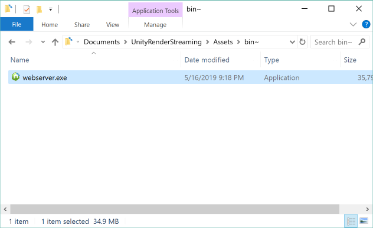

# 利用を開始するには

### パッケージのダウンロード

[Github Release](https://github.com/Unity-Technologies/UnityRenderStreaming/releases) でパッケージを配布しています。2つのパッケージをダウンロードしてください。

- com.unity.webrtc.tgz
- com.unity.template.renderstreaming.tgz

### プロジェクトテンプレート (Experimental)

**Unity Render Streaming** はプロジェクトテンプレートを試験的に提供しています。プロジェクトテンプレートは、Unity で新規プロジェクトを作成するときにテンプレートとして選択することができます。

テンプレートパッケージを利用する際は、2つのtgzファイルをそれぞれ以下のフォルダに配置します。

### Web サーバの起動

Webサーバの実行ファイルは `Assets/~bin/` 以下に配置しています。ファイルを実行すると、コマンドプロンプトが起動します。

コマンドプロンプトに以下のようなログが表示されていることを確認してください。 Web サーバのIPアドレスが表示されます。

<< コマンドプロンプトの画像を挿入>>

Webサーバのソースコードは [WebApp](WebApp) に配置しています。なお、ソースコードを実行するためには [node.js](https://nodejs.org) をインストールする必要があります。公式サイトからインストーラをダウンロードしてインストールしてください。

### Unity 側の設定

サンプルシーン `Assets/Scenes/SampleScene.unity` を開きます。

<< Unity の画面をスクショを挿入 >>

ヒエラルキービューの `RenderStreaming` を選択肢、インスペクタビューの `Render Streaming` コンポーネントを確認してください。

インスペクタの各設定について以下を参照してください。

|パラメータ|説明|デフォルト|
|-------|-----|-----|
|URL signaling|シグナリングサーバのURLを指定します|http://localhost|
|URL list Ice server|STUN/TURN サーバをリストで指定します|\[stun:stun.l.google.com:19302\]|
|Interval|シグナリングサーバへのポーリング頻度を秒単位で指定します|5|

### Webページへのアクセス

[対応ブラウザ]()のリストに含まれているブラウザを開いてください。
コマンドプロンプトに表示されている IPアドレスにアクセスしてください。以下のようにウェブページが表示されます。

<< ウェブページの画像を挿入 >>

動作が確認できない場合、ブラウザのバージョンが古い可能性があります。最新のバージョンをインストールしてください。

