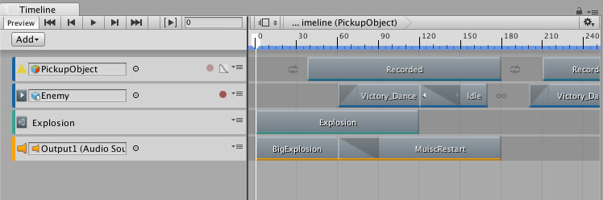

# About Unity Render Streaming

Use the &lt;package name&gt; package to &lt;list of the main uses for the package&gt;. For example, use &lt;package name&gt; to create/generate/extend/capture &lt;mention major use case, or a good example of what the package can be used for&gt;. The &lt;package name&gt; package also includes &lt;other relevant features or uses&gt;.

# Installing Unity Render Streaming
To install this package, follow the instructions in the [Package Manager documentation](https://docs.unity3d.com/Packages/com.unity.package-manager-ui@latest/index.html). 

In addition, you need to install the following resources:

 - &lt;name of resource&gt;: To install, open *Window > &lt;name of menu item&gt;*. The resource appears &lt;at this location&gt;.
 - &lt;name of sample&gt;: To install, open *Window > &lt;name of menu item&gt;*. The new sample folder appears &lt;at this location&gt;.

# Using Unity Render Streaming
For packages that augment the Unity Editor with additional features, this section should include workflow and/or reference documentation:

* At a minimum, this section should include reference documentation that describes the windows, editors, and properties that the package adds to Unity. This reference documentation should include screen grabs (see how to add screens below), a list of settings, an explanation of what each setting does, and the default values of each setting.
* Ideally, this section should also include a workflow: a list of steps that the user can easily follow that demonstrates how to use the feature. This list of steps should include screen grabs (see how to add screens below) to better describe how to use the feature.

For packages that include sample files, this section may include detailed information on how the user can use these sample files in their projects and scenes. However, workflow diagrams or illustrations could be included if deemed appropriate.

## How to add images

If the [Using &lt;package name&gt;](#UsingPackageName) section includes screen grabs or diagrams, a link to the image must be added to this MD file, before or after the paragraph with the instruction or description that references the image. In addition, a caption should be added to the image link that includes the name of the screen or diagram. All images must be PNG files with underscores for spaces. No animated GIFs.

An example is included below:

Notice that the example screen shot is included in the images folder. All screen grabs and/or diagrams must be added and referenced from the images folder.

For more on the Unity documentation standards for creating and adding screen grabs, see this confluence page: https://confluence.hq.unity3d.com/pages/viewpage.action?pageId=13500715
# Technical details
## Requirements
This version of &lt;package name&gt; is compatible with the following versions of the Unity Editor:

* 2018.1 and later (recommended)

To use this package, you must have the following 3rd party products:

* &lt;product name and version with trademark or registered trademark.&gt;
* &lt;product name and version with trademark or registered trademark.&gt;
* &lt;product name and version with trademark or registered trademark.&gt;

## Known limitations
&lt;package name&gt; version &lt;package version&gt; includes the following known limitations:

* &lt;brief one-line description of first limitation.&gt;
* &lt;brief one-line description of second limitation.&gt;
* &lt;and so on&gt;

## Package contents
The following table indicates the &lt;describe the breakdown you used here&gt;:

|Location|Description|
|---|---|
|`<folder>`|Contains &lt;describe what the folder contains&gt;.|
|`<file>`|Contains &lt;describe what the file represents or implements&gt;.|

## Document revision history
|Date|Reason|
|---|---|
|Sept 12, 2017|Unedited. Published to package.|
|Sept 10, 2017|Document updated for package version 1.1. New features: <li>audio support for capturing MP4s.<li>Instructions on saving Recorder prefabs|
|Sept 5, 2017|Limited edit by Documentation Team. Published to package.|
|Aug 25, 2017|Document created. Matches package version 1.0.|