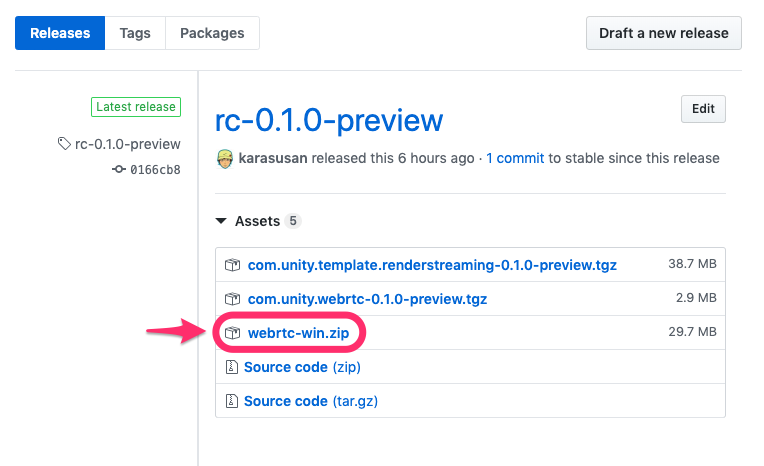
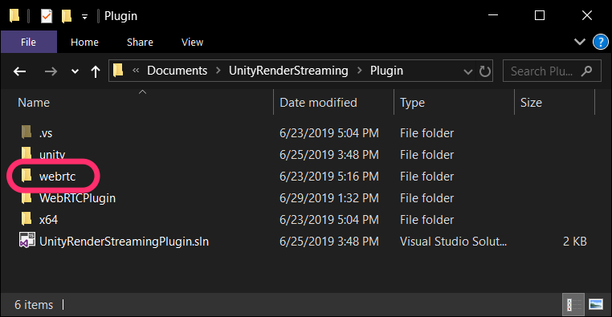
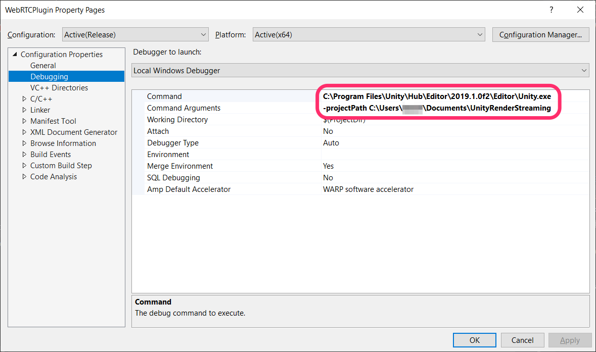
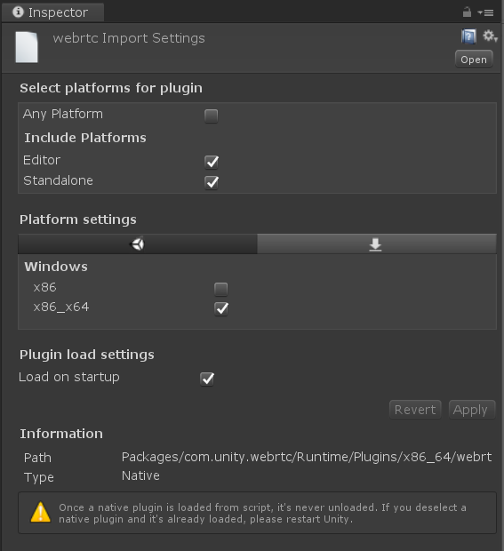

# Building the Plugin

This guide will cover building and deploying the native plugin `com.unity.webrtc` depends on.

### Embedding libwebrtc

The plugin relies on **libwebrtc**, so building it requires a static libwebrtc link. `webrtc-win.zip` can be found on the Github Release page.

 

Extract the files from the zip, and place them in the Plugin folder.

### Build

Version 1.0 is currently built with **Visual Studio 2017**. 

### Project Settings

The `WebRTCPlugin` project properties must be adjusted to match your environment in order to build the plugin. 

Set the Unity .exe path under `Command` and the project path under `Command Arguments`. Once set, during debugging the Unity Editor will run and breakpoints will be enabled.  

### Deploying the Plugin

When you run the build, `webrtc.dll` will be placed in `Packages\com.unity.webrtc\Runtime\Plugins\x86_64`. You should then be able to verify the following settings in the Unity Inspector window. 

