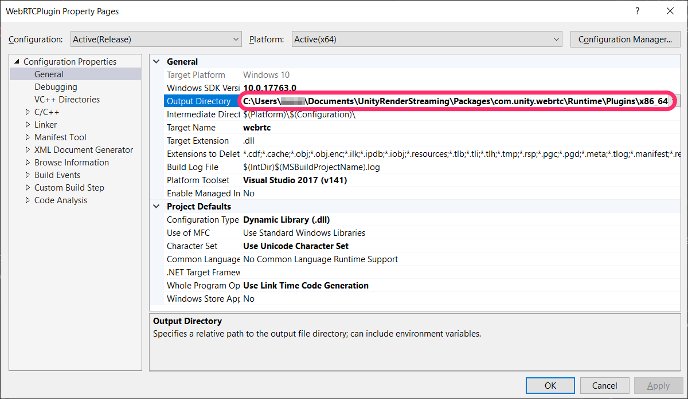

# Building the plugin

### Embedding libwebrtc

The plugin relies on **libwebrtc**, so building it requires a static link to libwebrtc. `webrtc-win.zip` can be found on the Github Release page.

 

Extract the files from the zip, and place them in the Plugin folder.

### Build

version 1.0 is currently built with **Visual Studio 2017**. Version 1.2 and after may migrate to **CMake**.

### Debug

Runtime debugging requires changes to the WebRTCPlugin project's properties. 

Set the Output Directory to `Packages\com.unity.webrtc\Runtime\Plugins\x86_64`.

Set the Unity.exe file path under Command, and set the project path under Command Arguments.

