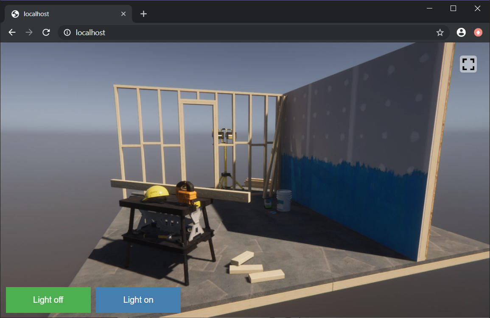

# Unity Render Streaming


**Unity Render Streaming** is a solution that provides Unity's high quality rendering abilities via browser. It's designed to meet the needs of tasks like viewing car configurators or architectural models on mobile devices.  
This solution's streaming technology takes advantage of [WebRTC](https://webrtc.org/), and developers can even use the [WebRTC package](https://github.com/Unity-Technologies/com.unity.webrtc) to create their own unique solutions. 



This repository manages 1 package and 2 templates. Details can be found in the `README.md` for each package.

- [com.unity.template.renderstreaming-hd](com.unity.template.renderstreaming-hd/Packages/com.unity.template.renderstreaming-hd/README.md)
- [com.unity.template.renderstreaming-rtx](com.unity.template.renderstreaming-rtx/Packages/com.unity.template.renderstreaming-rtx/README.md)
- [com.unity.renderstreaming](com.unity.renderstreaming/README.md)

## Branch

| Branch                                                                                         | Status         |
| ---------------------------------------------------------------------------------------------- | -------------- |
| [release/3.0.0](https://github.com/Unity-Technologies/UnityRenderStreaming/tree/release/3.0.0) | Stable         |
| [develop](https://github.com/Unity-Technologies/UnityRenderStreaming/tree/develop)             | In development |

## Requirements

Please see [Requirements](com.unity.renderstreaming/Documentation~/index.md#requirements) section.

### Furioos compatibility

**Unity Render Streaming** is also supported natively by Furioos platform https://www.furioos.com/ .
That means that you can easily build a RenderStreaming application, upload it on Furioos and enjoy all the features of RenderStreaming without worrying about the deployment and scalability issues of your project.
To do so, the requirement is to select "FurioosSignaling" in the "Signaling server type" parameter of the RenderStreaming script.
This allow your application to connect to Furioos services when running on the managed virtual machines.
Then just build a standalone Windows version of your application, zip it and upload it on your account at https://portal.furioos.com/ .

### License

- `com.unity.renderstreaming` -  [LICENSE.md](com.unity.renderstreaming/LICENSE.md)

- `com.unity.template.renderstreaming-hd` -  [LICENSE.md](com.unity.template.renderstreaming-hd/Packages/com.unity.template.renderstreaming-hd/LICENSE.md)

- `com.unity.template.renderstreaming-rtx` -  [LICENSE.md](com.unity.template.renderstreaming-rtx/Packages/com.unity.template.renderstreaming-rtx/LICENSE.md)

## Package Structure

```
<root>
├── com.unity.renderstreaming
│   ├── Documentation~
│   ├── Editor
│   ├── Runtime
│   ├── Samples~
│   └── Test
├── com.unity.template.renderstreaming-hd
│   ├── Assets
│   │   ├── Plugins
│   │   ├── Scenes
│   │   ├── Scripts
│   │   └── Tests
│   ├── Packages
│   └── ProjectSettings
├── com.unity.template.renderstreaming-rtx
│   ├── Assets
│   │   ├── Plugins
│   │   ├── Scenes
│   │   ├── Scripts
│   │   └── Tests
│   ├── Packages
│   └── ProjectSettings
├── RenderStreaming~
│   ├── Assets
│   ├── Packages
│   └── ProjectSettings
└── WebApp
    ├── public
    ├── src
    └── test
```

## Roadmap

| Version | Focus                                                   |
| ------- | ------------------------------------------------------- |
| `1.0`   | - First release                                         |
| `1.1`   | - Upgrade HDRP version 5.16                             |
| `1.2`   | - Unity 2019.3 support                                  |
| `2.0`   | - Multi camera <br>- DirectX12 (DXR) Support            |
| `2.1`   | - Unity 2019.4 support <br>- Add bitrate control sample |
| `2.2`   | - Add video receiver <br>- HDRP/URP on Linux support    |
| `3.0`   | - iOS platform support <br>- AR Foundation sample       |
| `3.1`   | - Android platform support                              |

## FAQ

Read [this page](com.unity.renderstreaming/Documentation~/faq.md) and [Unity Forum](https://forum.unity.com/forums/unity-render-streaming.413/)

## Contributors

- [@karasusan](https://github.com/karasusan)
- [@hiroki-o](https://github.com/hiroki-o)
- [@flame99999](https://github.com/flame99999)
- [@koseyile](https://github.com/koseyile)
- [@sindharta](https://github.com/sindharta)
- [@kannan-xiao4](https://github.com/kannan-xiao4)
- [@samuel-tranchet](https://github.com/samuel-tranchet)
