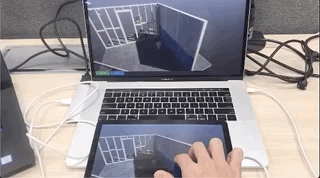

# Unity Render Streaming


**Unity Render Streaming** is a solution that provides Unity's high quality rendering abilities via browser. It's designed to meet the needs of tasks like viewing car configurators or architectural models on mobile devices.  
This solution's streaming technology takes advantage of [WebRTC](https://webrtc.org/), and developers can even use the WebRTC API to create their own unique solutions.



This repository manages 3 packages. Details can be found in the README.md for each package.

- [com.unity.template.renderstreaming](Packages/com.unity.template.renderstreaming/Documentation~/index.md)
- [com.unity.renderstreaming](Packages/com.unity.renderstreaming/Documentation~/index.md)
- [com.unity.webrtc](Packages/com.unity.webrtc/Documentation~/index.md)

## Operating Environment

This solution is compatible with Unity 2019.1. Currently it only runs in a Windows 64-bit environment.
Unity 2018.3 relies on the [New Input System](https://github.com/Unity-Technologies/InputSystem), so it is incompatible with this solution.

### Supported Browsers

Browser support depends on the status of each browser's WebRTC support.

- Desktop Chrome
- Desktop Firefox
- Desktop Safari
- Android Chrome
- iOS Safari

### License

`com.unity.template.renderstreaming` license
- [LICENSE.md](Packages/com.unity.template.renderstreaming/LICENSE.md)

`com.unity.webrtc` license
- [LICENSE.md](Packages/com.unity.webrtc/LICENSE.md)
- [Third Party Notices.md](Packages/com.unity.webrtc/Third%20Party%20Notices.md)

### Graphics Cards

This solution is optimised for NVIDIA graphics cards. Using a recommended graphics card will allow streaming with lower latency. See NVIDIA's [NVIDIA VIDEO CODEC SDK](https://developer.nvidia.com/video-encode-decode-gpu-support-matrix) webpage for a list of recommended graphics cards.

## Package Structure

```
<root>
├── Assets
│   ├── Plugins
│   ├── Scenes
│   ├── Scripts
│   └── Tests
├── Packages
│   ├── com.unity.renderstreaming
│   ├── com.unity.template.renderstreaming
│   └── com.unity.webrtc
├── ProjectSettings
├── Plugin
│   ├── WebRTCPlugin
│   └── unity
├── RenderStreamingSampleSrc~
│   └── RS_HDRPSampleSrc_1.x
└── WebApp
    ├── public
    ├── src
    └── test
```

## Roadmap

|Version|libwebrtc version|Focus|
|-------|-----|-----|
|`1.0`|[M72](https://groups.google.com/forum/#!msg/discuss-webrtc/3h4y0fimHwg/j6G4dTVvCAAJ)|- First release |
|`2.0`||- Multi camera <br>- Simulcast |
|`2.1`||- Linux support <br>- Add HW encoder<br>- <br>- |

## FAQ

Read [this page](Packages/com.unity.template.renderstreaming/Documentation~/en/faq.md).

## Sample Sources
- [HDRP](RenderStreamingSampleSrc~/RS_HDRPSampleSrc_1.x/Documentation/index.md)

## Contributors

- [@karasusan](https://github.com/karasusan)
- [@hiroki-o](https://github.com/hiroki-o)
- [@flame99999](https://github.com/flame99999)
- [@koseyile](https://github.com/koseyile)
- [@sindharta](https://github.com/sindharta)
