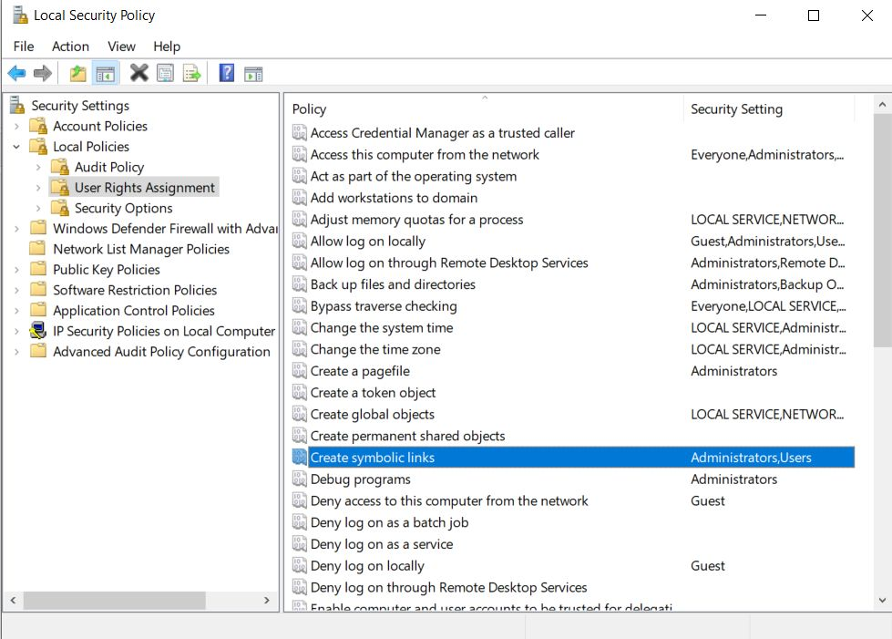
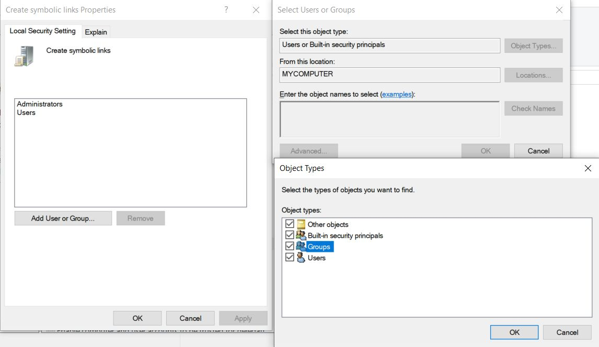
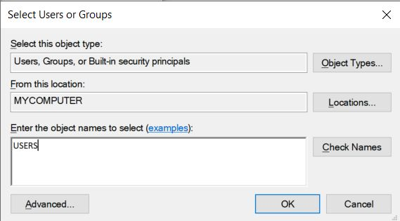

# RenderStreaming - HDRP Sample Source 

- [Japanese](./jp/index.md)

This project contains all the assets that are used to create the HDRP sample for 
[**com.unity.renderstreaming**](../../../Packages/com.unity.renderstreaming/Documentation~/index.md)
package.

Symbolic links are used to share assets between this project and [the main project](../../../Readme.md),
and on Windows, prior setup is necessary to enable symbolic links, as described below.

## Setting up Git symbolic links for all users on Windows 10

1. Open **Local Security Policy** by typing `secpol.msc` on Windows Command Prompt

>

   
2. Under **User Rights Assignment**, find a policy called **Create symbolic links** and open it.
   - Click **Add User or Group**
   - Click **Object Types**
   - Make sure **Groups** is checked and click **OK**.
   


3. Type **USERS** inside the textbox and click on **Check Names** to verify it, then click **OK**.



4. Open git terminal on the local repository folder and type the following

```
git config --local core.symlinks true
git config --system core.symlinks true
git config --global core.symlinks true
```

5. If you have checked out the repository before doing the above setup, you may need to do 
   a reset by executing `git reset --hard`. Be careful though as this command will discard 
   local changes to all files permanently.

  

