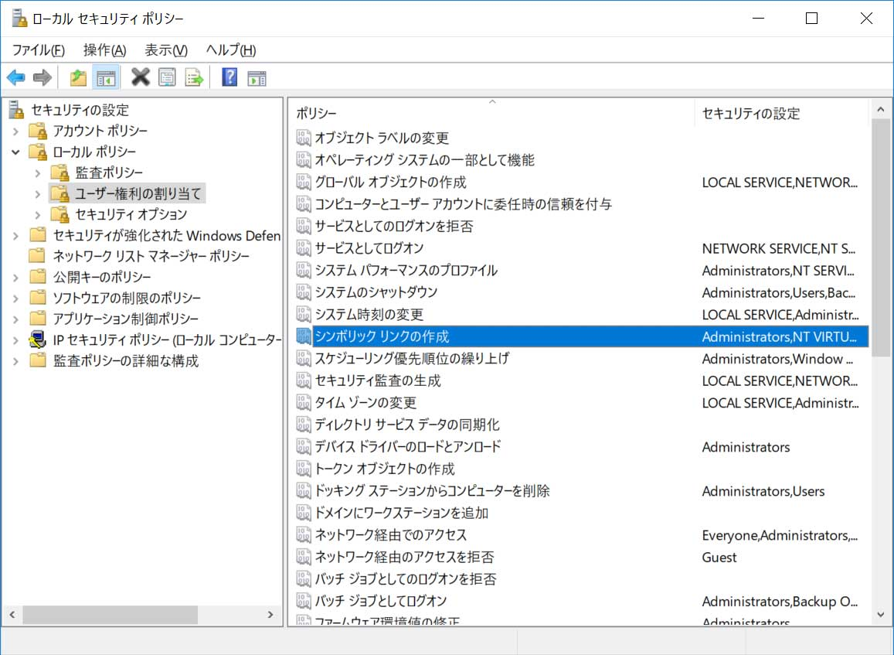
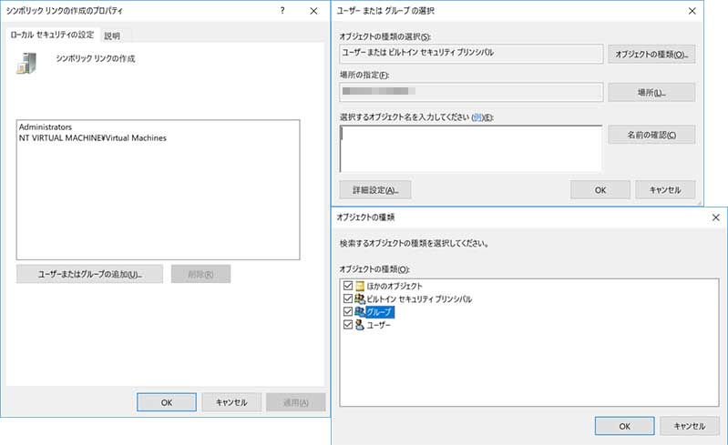
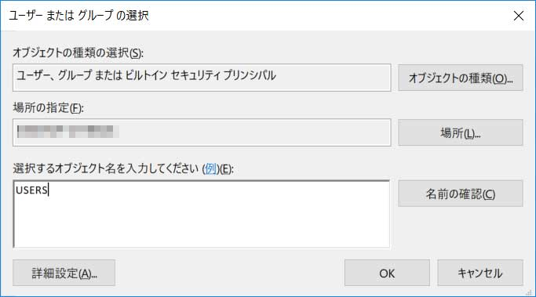

# RenderStreaming - HDRP サンプルソース

- [English](../index.md)

このプロジェクトには、
[**com.unity.renderstreaming**](../../../../Packages/com.unity.renderstreaming/Documentation~/index.md) パッケージの HDRP サンプルの作成に使われているすべてのアセットが含まれています。

このプロジェクトと[メインのプロジェクト](../../../../Readme.md)の間でのアセットの共有にはシンボリックリンクを使っています。
Windows をお使いの場合は、以下の手順に従って事前にシンボリックリンクを有効にする必要があります。

## Windows 10 で Git シンボリックリンクをすべてのユーザーで有効にする手順

1. Windows コマンドプロンプトを開き、`secpol.msc` とタイプして、**ローカル セキュリティ ポリシー** ウィンドウを開いてください。



   
2. **ユーザー権利の割り当て**を選択し、**シンボリック リンクの作成** という名前のポリシーを開いてください。
   - **ユーザーまたはグループの追加**をクリックしてください。
   - **オブジェクトの種類**をクリックしてください。
   - **グループ**のチェックをオンにして、**OK** をクリックしてください。
   


3. テキストボックスに **USERS** と入力し、**名前の確認**をクリックして確認してください。問題なければ **OK** をクリックしてください。



4. Git ターミナルを開いて、ローカルのレポジトリフォルダーに移動し、以下のコマンドを実行してください。

```
git config --local core.symlinks true
git config --system core.symlinks true
git config --global core.symlinks true
```

5. 上記の設定を行う前にレポジトリをチェックアウトしていた場合は、`git reset --hard` を実行によるリセットが必要な場合があります。このコマンドを実行すると、レポジトリのすべてのファイルに対して、ローカルで加えた変更が破棄されるのでご注意ください。

  

