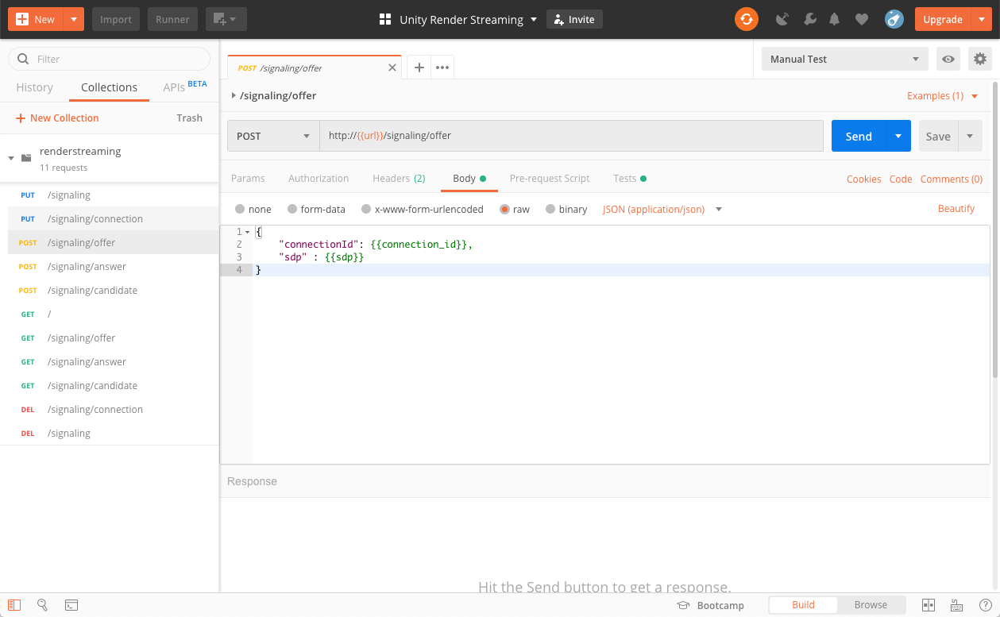

# Render Streaming WebApp

### Web アプリケーションの実行

Web アプリケーションのソースコードは  `WebApp` フォルダに配置しています。ソースコードを利用するには [Node.js](https://nodejs.org/) をインストールする必要があります。

**Node.js** を利用してWeb アプリケーションを起動するには、以下のコマンドを実行します。

```shell
npm run build
npm run start
```

以下のコマンドでヘルプを表示します。

```shell
npm run start -- -h
```

オプションの詳細については[ドキュメント](../Packages/com.unity.template.renderstreaming/Documentation~/jp/webserver.md)を参照してください。

また、以下のコマンドで `ts-node` を利用してサーバを起動します。

```shell
npm run dev
```

### Web アプリケーションの配布

Web アプリケーションを配布する際、環境構築の手間を省略するために、Web アプリケーションを実行可能なバイナリに変換することが可能です。以下コマンドでバイナリに変換します。

```shell
npm run pack
```

### Web API の確認

Render Streaming のシグナリングはシンプルな Web API で実現しています。API の確認には [Postman](https://www.getpostman.com/) が利用できます。

Postman で `WebApp/test/renderstreaming.postman_collection.json` をインポートすると、API の一覧を確認することができます。また、Web サーバを起動した状態であれば API の動作テストを行うことができます。


