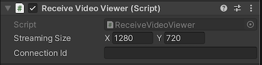

# Audio Streaming

`AudioSender` class and `AudioReceiver` class are the base classes for sending and receiving audio. And various components are implemented using inheritance relationships with these class. Components are provided for the sender and receiver.

> [!NOTE] 
> There is currently a limitation in the audio codec selection. Currently, only **Opus** is used for the audio codec.

## `AudioClipSender` component

This component streams the audio rendering results from [`AudioListener`](https://docs.unity3d.com/ScriptReference/AudioListener.html) component or [`AudioSource`](https://docs.unity3d.com/ScriptReference/AudioSource.html) component.

### Properties

| Parameter | Description | Default |
| --------- | ----------- | ------- |
| **Audio Source** | [`AudioSource`](https://docs.unity3d.com/ScriptReference/AudioSource.html) instance for sending audio | None |

## `MicrophoneSender` component

This component streams the audio rendering results from [`Microphone`](https://docs.unity3d.com/ScriptReference/Microphone.html).

### Properties

| Parameter | Description | Default |
| --------- | ----------- | ------- |
| **Audio Source** | [`AudioSource`](https://docs.unity3d.com/ScriptReference/AudioSource.html) instance for sending audio | None |
| **Device Index** | An index of the list of available microphone devices | 0 |

An index of the list of available microphone devices

## `AudioClipReceiver` component

The components receive audio track stream and rendering to [`AudioSource`](https://docs.unity3d.com/ScriptReference/AudioSource.html).

