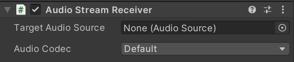

# Audio Streaming Component

[`AudioStreamSender`](../api/Unity.RenderStreaming.AudioStreamSender.html) class and [`AudioStreamReceiver`]((../api/Unity.RenderStreaming.AudioStreamReceiver.html)) class are the base classes for sending and receiving audio. Components are provided for the sender and receiver.

## [`AudioStreamSender`](../api/Unity.RenderStreaming.AudioStreamSender.html) component reference

This component streams the audio rendering results from [`AudioListener`](https://docs.unity3d.com/ScriptReference/AudioListener.html) component or [`AudioSource`](https://docs.unity3d.com/ScriptReference/AudioSource.html) component.

### Properties

| Parameter | Description | Default |
| --------- | ----------- | ------- |
| **Audio Source Type** | Choose the type of source for your audio streaming.    - *Audio Listener*   - *Audio Source*   - *Microphone* | *Audio Listener* |
| *Audio Listener* | [`Audio Listener`](https://docs.unity3d.com/ScriptReference/AudioSource.html) instance for sending audio | |
| *Audio Source* | [`Audio Source`](https://docs.unity3d.com/ScriptReference/AudioSource.html) instance for sending audio | |
| *Microphone Device Index* | The index of the microphone input device to be used. See [Microphone.devices](https://docs.unity3d.com/ScriptReference/Microphone-devices.html). | 0 |
| *Auto Request User Authorization* | Whether request permission to use microphone. You don't need to enable it if you call [Application.RequestUserAuthorization](https://docs.unity3d.com/ScriptReference/Application.RequestUserAuthorization.html) yourself. | Enabled |
| **Audio Codec** | *Default* option means trying to use all available codecs for negotiating other peers. | Default |
| *Loopback* | The sending audio is also played on sender side. | Disabled |
| **Bitrate (kbits/sec)** | The bitrate of the audio streaming. | |
| *Min* | The minimum value of the bitrate. | 0 |
| *Max* | The maximum value of the bitrate. | 1000 |

## [`AudioStreamReceiver`](../api/Unity.RenderStreaming.AudioStreamReceiver.html) component reference

The components receive audio track stream and rendering to [`AudioSource`](https://docs.unity3d.com/ScriptReference/AudioSource.html).

### Properties

| Parameter | Description | Default |
| --------- | ----------- | ------- |
| **Target Audio Source** | [`AudioSource`](https://docs.unity3d.com/ScriptReference/AudioSource.html) instance for sending audio | None |
| **Audio Codec** | *Default* option means trying to use all available codecs for negotiating other peers. | Default |
