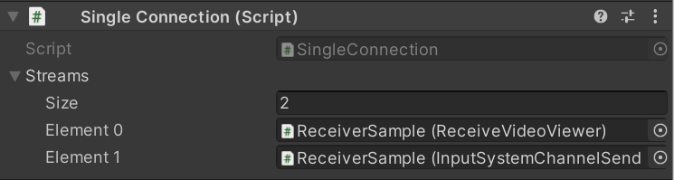

# Components Settings

## `Render Streaming`

**Render Streaming** includes the following features.

- Communication with signaling servers
- Streaming input from cameras 
- Associating browser input with events

### Properties

| Parameter                    | Description                                                                                                                | Default                         |
| ---------------------------- | -------------------------------------------------------------------------------------------------------------------------- | ------------------------------- |
| **Signaling Type**           | Class type of the signaling | `WebSocketSignaling`                |
| **Signaling URL**            | Set the signaling server URL  If you use WebSocket as a signaling protocol, you should specify a URL starting with `ws` or `wss`. | `ws://localhost`             |
| **Ice Servers**              | Set a list of STUN/TURN servers                                                                                            |                                 |
| *Urls*                       | Set URLs of STUN/TURN servers                                                                                              | `[stun:stun.l.google.com:19302\]` |
| *Username*                   | The username to use when logging into the TURN server                                                                      |                                 |
| *Credencial*                 | The credential to use when logging into the TURN server                                                                    |                                 |
| *Credencial Type*            | This attribute specifies what kind of `credential` is to be used when connecting to the TURN server                        | `Password`                        |
| **Interval**                 | Set the polling frequency (in seconds) to the signaling server  Valid only if you are using Http as the signaling protocol. | 5 (sec)                         |
| **Hardware Encoder Support** | Enable the checkbox to make this video encoding replace values that use a [hardware encoder](index.md#hardware-encoder) | `False`                         |
| **Handlers**                 | Register browser button click events                                                                                       |                                 |
| **Run On Awake**               | Automatically started when called `Awake` method                                                                                                     | `True`                              |

## `CameraStreamer`

This component streams the `Camera` component's camera rendering results.  Uses `Target Texture` to store the rendering results.

> [!NOTE]
> You can attach the `Target Texture` to the `Camera` component.
> If `Target Texture` is attached on Camera, use that `Render Texture` setting first.

### Properties

| Parameter                    | Description                                                         | Default                         |
| ---------------------------- | ------------------------------------------------------------------- | ------------------------------- |
| **Streaming Size**           | Size of the frame buffer used for streaming                         | 1280, 720                       |
| **Anti-aliasing**            | The antialiasing level for the RenderTexture                        | None                            |
| **Depth Buffer**             | The precision of the render texture's depth buffer in bits          | No depth buffer                 |

## `WebCamStreamer`

This component streams the `WebCamTexture` rendering results. Please refer [WebCamTexture](https://docs.unity3d.com/ScriptReference/WebCamTexture.html) pages.

> [!NOTE]
> When building application for iOS platform, you need set `Camera Usage Description` on Player Settings.
> If not set this, your application exits. (refer [this page](https://developer.apple.com/library/archive/documentation/General/Reference/InfoPlistKeyReference/Articles/CocoaKeys.html#//apple_ref/doc/uid/TP40009251-SW24))

### Properties

| Parameter                    | Description                                                         | Default                         |
| ---------------------------- | ------------------------------------------------------------------- | ------------------------------- |
| **Streaming Size**           | Size of the frame buffer used for streaming                         | 1280, 720                       |
| **Device Index**             | Index of `WebCamTexutre.devices` to use                             | 0                               |

## `AudioStreamer`

This component streams the `AudioListener` component's audio rendering results. 

### Properties

None

## `ReceiveVideoViewer`

This component receives a videostream and exposes a texture that rendered the receiving frame buffer. 

### Properties

| Parameter                    | Description                                                         | Default                         |
| ---------------------------- | ------------------------------------------------------------------- | ------------------------------- |
| **Streaming Size**           | Size of the frame buffer used for streaming                         | 1280, 720                       |
| **Connection Id**            | ID of receiving videostream                                         | Empty                           |

## `InputSystemChannelSender`

This component sends input events from Unity.

### Properties

| Parameter                    | Description                                                         | Default                         |
| ---------------------------- | ------------------------------------------------------------------- | ------------------------------- |
| **Local**           | Channel is local or remote                         | `False`                       |
| **Label**            | Channel label                                         | Empty                           |

## `InputSystemChannelReceiver`

This component receives input events from Unity.

### Properties

| Parameter                    | Description                                                         | Default                         |
| ---------------------------- | ------------------------------------------------------------------- | ------------------------------- |
| **Local**           | Channel is local or remote                         | `False`                       |
| **Label**            | Channel label                                         | Empty                           |

## `WebBrowserInputChannelReceiver`

This component receives input events from web browsers.

### Properties

| Parameter                    | Description                                                         | Default                         |
| ---------------------------- | ------------------------------------------------------------------- | ------------------------------- |
| **Local**           | Channel is local or remote                         | `False`                       |
| **Label**            | Channel label                                         | Empty                           |
| **Array Button Click Event** | Register browser button click events                                                                                       | []                                |
| *Element Id*                 | Set an ID that is sent from browsers                                                                                       |                                 |
| *Click*                      | Set button click event                                                                                                     |                                 |

## `SingleConnection`

This component lists components that stream media or data via a single peer connection.

### Properties

| Parameter                    | Description                                                         | Default                         |
| ---------------------------- | ------------------------------------------------------------------- | ------------------------------- |
| **Streams**           | List of streams                         | []                       |

## `Broadcast`

This component lists components that stream media or data via multiple peer connections.

### Properties

| Parameter                    | Description                                                         | Default                         |
| ---------------------------- | ------------------------------------------------------------------- | ------------------------------- |
| **Streams**           | List of streams                         | []                       |
