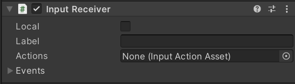

# Setting Up Device Input

To control the camera on the remote PC,  we need to link the input events on web browsers to the actions in Unity. **Input System** makes it easy to implement the input processing.

## Check settings of Input System

First, please check the [Wizard window](wizard.md) about the Input System settings.

## Adding components for input processing

Open the Unity scene which created in [the previous page](create-camera.md), and select **Main Camera** in the Hierarchy window. Add the **Input Receiver** component in the Inspector window.


The initial condition of the inspector of **Input Receiver** is below.



Add the **Input Receiver** component to the **Broadcast** component property.


## Setting Input Actions

We will use the [**Input Actions**](https://docs.unity3d.com/Packages/com.unity.inputsystem@1.0/manual/Actions.html) feature of the Input System. Input Actions is a mechanism for mapping various inputs to Unity actions, and it provides editing tools that make it easy for anyone to use. We will use Input Actions to define mouse actions.

Right-click in the project window, and then click **Create > Input Actions**.


The asset will be added to the project window and rename to **Control**. Double-click on the **Control** asset in the project window, and the **Action editor** will appear.


Click the **+** button in **Actions Maps** to add an item.


Rename the **Actions** item to `Look`.


Select the item and change **Action Type** to `Value`, and **Control Type** to `Vector2`.


Next, select the **\<No Binding\>** item and add **Mouse > Delta** to the **Path** of **Binding**.


The result will look like this. Note that the last step is to press the **Save Asset** button to save your edits.


## Setting [`InputReceiver`](../api/Unity.RenderStreaming.InputReceiver.html) component

Drag the **Control** asset to the **Input Actions** property of the [`InputReceiver`](../api/Unity.RenderStreaming.InputReceiver.html) component.


Add the code to control the rotation of the camera. Move to the Inspector window, click **Add component** button and select **New Script** Script to create the asset. Change the asset name to `PlayerControler`.


The contents of the script will be as follows.

```csharp
using UnityEngine;
using UnityEngine.InputSystem;

public class PlayerController : MonoBehaviour
{
    public void Look(InputAction.CallbackContext value)
    {
        Vector2 input = value.ReadValue<Vector2>();
        transform.eulerAngles += new Vector3(-input.y, input.x, 0);
    }
}
```

Once you have copied the script and saved the file, assign `PlayerController.Look` to the [`InputReceiver`](../api/Unity.RenderStreaming.InputReceiver.html) component's **Look** event.


## Checking on browsers

The mouse operation in the browser should be reflected in the rotation of the camera. If the camera is not moved, please check the settings on the [Wizard](wizard.md) window.

## Next step

We were able to incorporate the input processing using the Input Actions feature. If you would like to learn more about the features of Unity Render Streaming, please see the [Sample page](samples.md). Also, check out [Customizing your web application](customize-webapp.md) for information on how to modify the web user interface.
