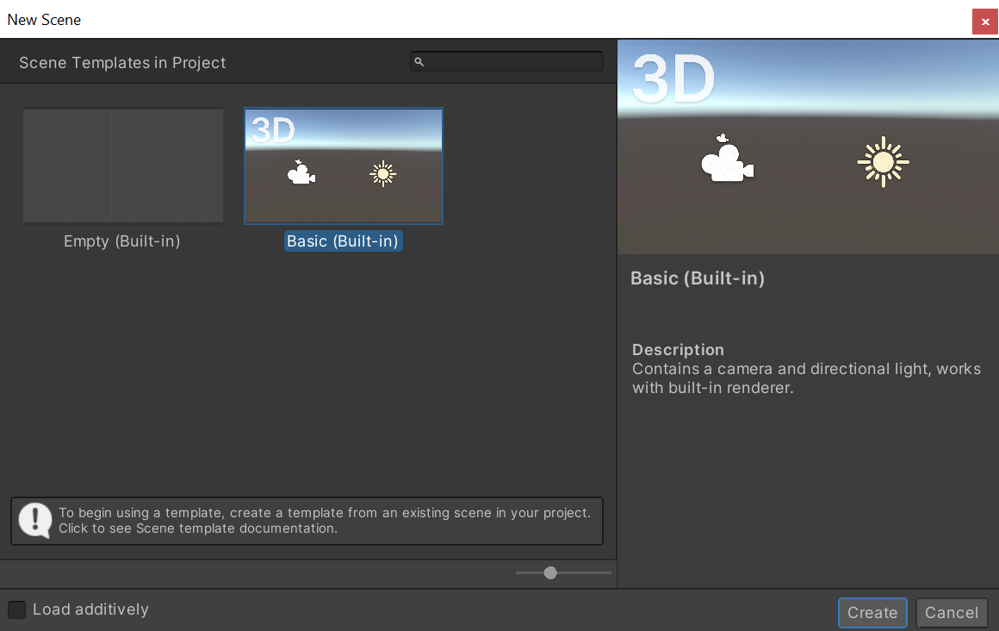
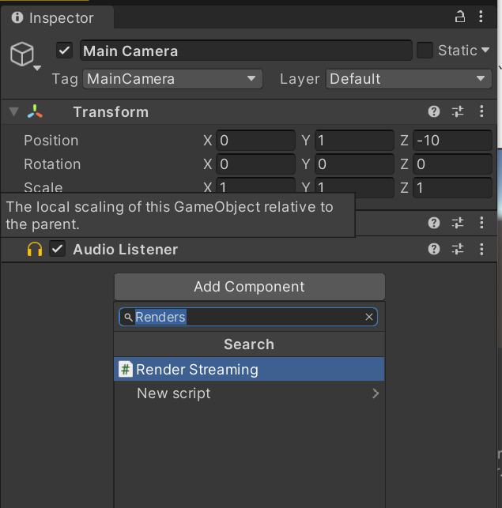
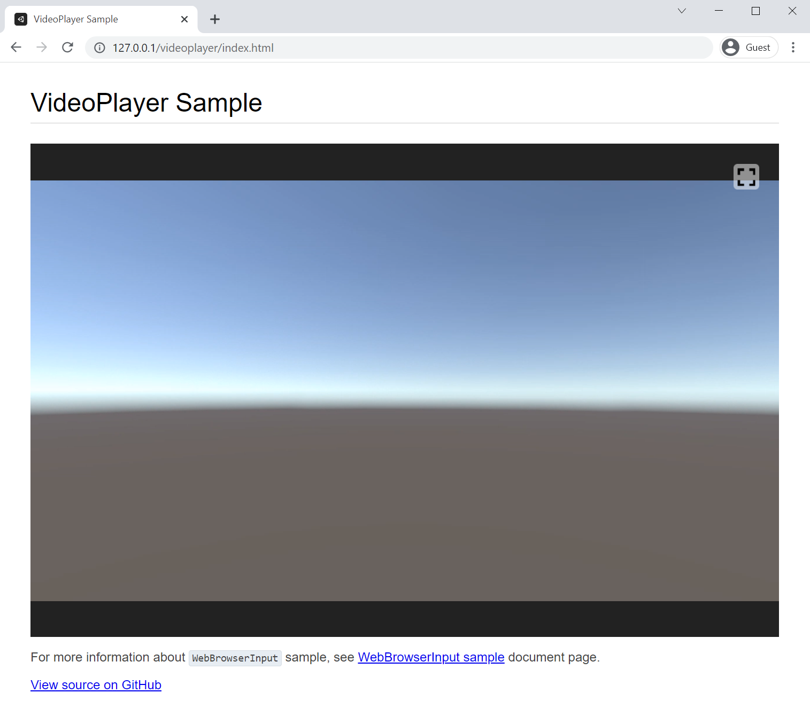

# Creating The Scene

This tutorial explains how to edit an empty scene in Unity and display the camera image in the browser.

## Setting component

Create a new empty scene. Select **File -> New Scene** from the menu to open the dialog and select **Basic (Built-in)**.

Select the **Main Camera** object in the Hierarchy window, and add the **Render Streaming** component in the Inspector window.

Next, we will add the **Broadcast** component. this component deliver the stream to multiple peers.

Assign the **Broadcast** component to the `Handler` property of the **Render Streaming** component.

Add a **Camera Streamer** component. This component refers to the **Camera** and delivers it as a stream to other peers.

Assign the **Camera Streamer** component to the **Broadcast** component property.

### Check on browser

Open the **VideoPlayer Sample** page, and you should see the video from the Unity camera appear in your browser.

## Next Step

You can distribute video from Unity to the browser. It is also possible to stream audio. There are several types of components that can be streamed. Check the [component page](components.md) for details.

Next, let's try to control the camera from the browser. Please go to [the next page](control-camera.md).