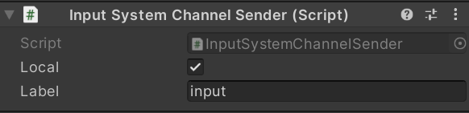
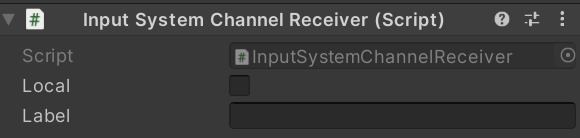

# Data Streaming

Data streaming is using [`RTCDataChannel`](https://docs.unity3d.com/Packages/com.unity.webrtc@2.4/manual/datachannel.html) of the WebRTC package internally.

Using the data streaming feature, we provide a component to send messages of [Input System](https://docs.unity3d.com/Packages/com.unity.inputsystem@latest). For more details, please check the section on [Using with Input System](use-inputsystem.md).

## `InputSender` component

This component sends input events fired from all input devices connected machine.

### Properties

| Parameter | Description | Default |
| --------- | ----------- | ------- |
| **Local** | Channel is local or remote | `False` |
| **Label** | Channel label | Empty |

## `InputReceiver` component

This component receives input events from Unity.

### Properties

| Parameter | Description | Default |
| --------- | ----------- | ------- |
| **Local** | Channel is local or remote | `False` |
| **Label** | Channel label | Empty |

## `DataSender` component

This component sends any data from Unity.

### Properties

| Parameter | Description | Default |
| --------- | ----------- | ------- |
| **Local** | Channel is local or remote | `False` |
| **Label** | Channel label | Empty |

## `DataReceiver` component

This component receives any data from Unity.

### Properties

| Parameter | Description | Default |
| --------- | ----------- | ------- |
| **Local** | Channel is local or remote | `False` |
| **Label** | Channel label | Empty |