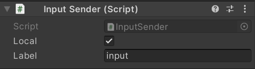
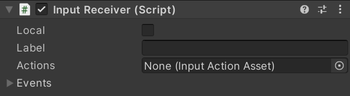

# Data Streaming Component

Data streaming is using [`RTCDataChannel`](https://docs.unity3d.com/Packages/com.unity.webrtc@2.4/manual/datachannel.html) of the WebRTC package internally.

Using the data streaming feature, Unity Render Streaming provides a component to send messages of [Input System](https://docs.unity3d.com/Packages/com.unity.inputsystem@latest).

## [`InputSender`](../api/Unity.RenderStreaming.InputSender.html) component reference

This component sends input events fired from all input devices connected machine.

### Properties

| Parameter | Description | Default |
| --------- | ----------- | ------- |
| **Local** | Channel is local or remote | `False` |
| **Label** | Channel label | Empty |

## [`InputReceiver`](../api/Unity.RenderStreaming.InputReceiver.html) component reference

This component receives input events from Unity.

### Properties

| Parameter | Description | Default |
| --------- | ----------- | ------- |
| **Local** | Channel is local or remote. | `False` |
| **Label** | Channel label. | Empty |
| **Actions** | The set of [**Input Actions**](https://docs.unity3d.com/Packages/com.unity.inputsystem@1.3/manual/Actions.html) associated with the player. To receive input, each player must have an associated set of Actions. See documentation on Actions for details. | `None` |
| *Default Map* | Which Action Map in `Actions` to enable by default. If set to `None`, then the player starts with no Actions being enabled. | `None` |
| **Events** | Uses a separate UnityEvent for each individual type of message.  | Empty |

