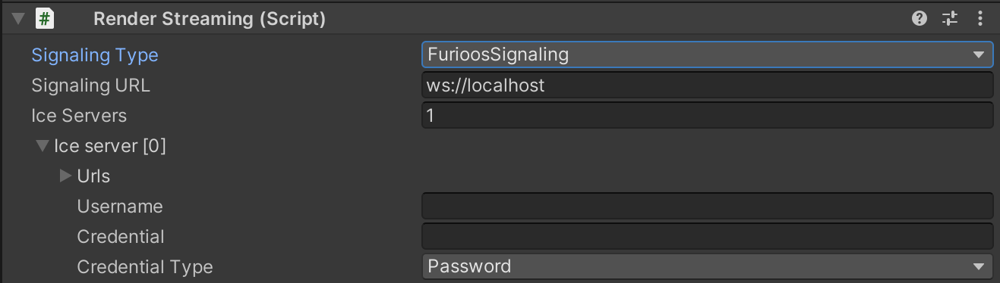
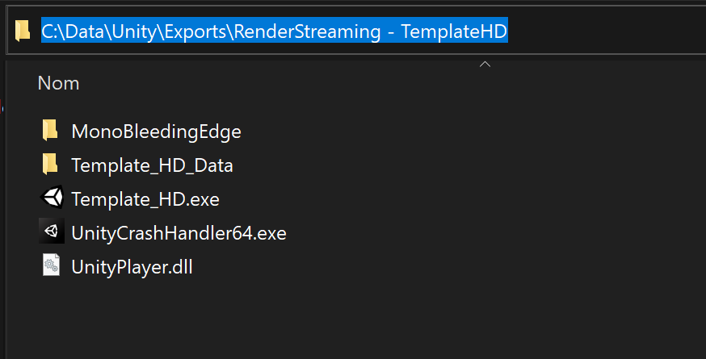
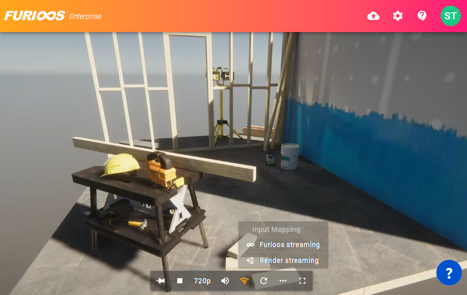

# Deploy to Furioos

As you may already know, **Unity Render Streaming** has a Furioos-compatible signaling option. This means that you can build a dedicated version of your application, host it on **Furioos**, and share it with thousands of customers who will enjoy all the features of **Unity Render Streaming**. But you will **not** have to deal with any of the difficulties of setting up a private server, a machine in the cloud or manage the scalability of your solution.

To do so, the requirement is to select `FurioosSignaling` in the `Signaling type` parameter of the [RenderStreaming](streaming-management.md#render-streaming) component.
This allow your application to connect to Furioos services when running on the managed virtual machines.

Then just build a **standalone Windows version** of your application, and zip it! Don't try to build iOS, Android, linux or whatever version of your app, **Furioos only support Windows applications**. Also, be sure to zip the whole exported folder with all files and sub-folders, not just the ".exe" file.

Finally just upload it on your account at https://portal.furioos.com/ .
If you need futher help to upload your application on **Furioos**, please follow [this tutorial](https://support.furioos.com/article/adding-an-application-on-furioos/).

You can check the stream type on https://portal.furioos.com/ by clicking to the "more options" button in the toolbar.

