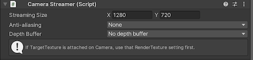

# Components Settings

## `Render Streaming` Components

**Render Streaming** includes the following features.

- Communication with signaling servers
- Streaming input from cameras 
- Associating browser input with events

## Properties

| Parameter                    | Description                                                                                                                | Default                         |
| ---------------------------- | -------------------------------------------------------------------------------------------------------------------------- | ------------------------------- |
| **URL Signaling**            | Set the signaling server URL  If you use WebSocket as a signaling protocol, you should specify a URL starting with `ws` or `wss`. | http://localhost                |
| **Ice Servers**              | Set a list of STUN/TURN servers                                                                                            |                                 |
| *Urls*                       | Set URLs of STUN/TURN servers                                                                                              | [stun:stun.l.google.com:19302\] |
| *Username*                   | The username to use when logging into the TURN server                                                                      |                                 |
| *Credencial*                 | The credential to use when logging into the TURN server                                                                    |                                 |
| *Credencial Type*            | This attribute specifies what kind of `credential` is to be used when connecting to the TURN server                        | Password                        |
| **Interval**                 | Set the polling frequency (in seconds) to the signaling server  Valid only if you are using Http as the signaling protocol. | 5 (sec)                         |
| **Hardware Encoder Support** | Enable the checkbox to make this video encoding replace values that use a [hardware encoder](../index.md#hardware-encoder) | Enabled                         |
| **Array Button Click Event** | Register browser button click events                                                                                       |                                 |
| *Element Id*                 | Set an ID that is sent from browsers                                                                                       |                                 |
| *Click*                      | Set button click event                                                                                                     |                                 |

## `CameraStreamer` Component

`Camera` コンポーネントのカメラのレンダリング結果をストリーミングします。 レンダリング結果を格納するために `Target Texture` を使用します。

### プロパティ

| パラメーター                   | 説明                                                                       | デフォルト                        |
| ---------------------------- | -------------------------------------------------------------------        | ------------------------------- |
| **Streaming Size**           | ストリーミングに使用するフレームバッファのサイズです                              | 1280, 720                       |

## `AudioStreamer` Component

`AudioListener` コンポーネントのオーディオのレンダリング結果をストリーミングします。 

### プロパティ

なし