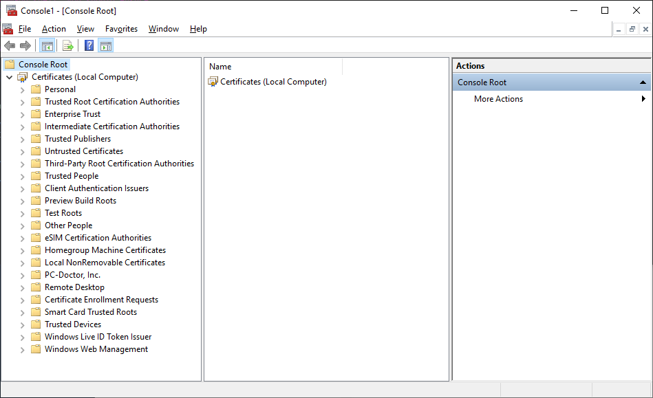

# Configure Self-Signed Credentials for https

## Prerequisites

### Windows

This document is written assuming that the OS is Windows.

### Chocolatey

**Chocolatey** is a package manager for Windows (like apt-get or yum but for Windows).
Link to install Chocolatey: [https://chocolatey.org/install](https://chocolatey.org/install)

### OpenSSL

OpenSSL is a robust, commercial-grade, and full-featured toolkit for the Transport Layer Security (TLS) and Secure Sockets Layer (SSL) protocols.
Installation:

```terminal
choco install openssl.light
```

## Step 1: Create a Private Key

Run the command:

```terminal
"C:\Program Files\OpenSSL\bin\openssl.exe" genrsa -des3 -out rootSSL.key 2048
```

Enter a Password:

```terminal
Enter pass phrase for rootSSL.key:
```

Verify the Password:

```terminal
Verifying - Enter pass phrase for rootSSL.key:
```

## Step 2: Create a Certificate File

Run the command:

```terminal
"C:\Program Files\OpenSSL\bin\openssl.exe" req -x509 -new -nodes -key rootSSL.key -sha256 -days 1024 -out rootSSL.pem
```

Enter the Password:

```terminal
Enter pass phrase for rootSSL.key:
```

Enter your Country's 2-Letter Code:

```terminal
Country Name (2 letter code) [AU]:CA
```

Enter the name of your state/province:

```terminal
State or Province Name (full name) [Some-State]:Quebec
```

Enter the name of your locality (city):

```terminal
Locality Name (eg, city) []:montreal
```

Enter the name of your organization:

```terminal
Organization Name (eg, company) [Internet Widgits Pty Ltd]:Unity
```

Enter the name of your business unit within the organization:

```terminal
Organizational Unit Name (eg, section) []:Verticals
```

Enter your computer's `fully qualified domain name` or your name:

```terminal
Common Name (e.g. server FQDN or YOUR name) []:Tony
```

Enter your e-mail address:

```terminal
Email Address []:anthonyma@unity3d.com
```

## Step 3: Get Windows to Trust the Certificate Authority (CA)

1. Search for and run `Microsoft Management Console (mmc.exe)`

    

2. Go to `File > Add/Remove Snap-in...`

    

3. Click on `Certificates` and then `Add >`

    

4. Select `Computer Account` and then `Next >`

    

5. Select `Local computer (the computer this console is running on)` and then `Finish`

    

6. Select `OK` in the `Add or Remove Snap-ins` window

    

7. Expand `Console Root > Certificates (Local Computer)` in the `Console1 - [Console Root]` window

    

8. Select `Trusted Root Certification Authorities` then `Right-Click` on `Certificates` and select `All Tasks > Import...`

    

9. Select `Next` in the `Certificate Import Wizard` window

    

10. Browse to the location of the `rootSSL.pem` file created in **Step 2** and then select `Next`.

    

11. Select `Place all certificates in the following store` and ensure that `Trusted Root Certification Authorities` is the value in the `Certificate store:` field, and then select `Next`.

    

12. Select `Finish`.

    

## Step 4: Create a Local Domain Site

1. Add `127.0.0.1 client-1.local` to your `C:\Windows\System32\drivers\etc\hosts` file.

    ```hosts
    # Copyright (c) 1993-2009 Microsoft Corp.
    #
    # This is a sample HOSTS file used by Microsoft TCP/IP for Windows.
    #
    # This file contains the mappings of IP addresses to host names. Each
    # entry should be kept on an individual line. The IP address should
    # be placed in the first column followed by the corresponding host name.
    # The IP address and the host name should be separated by at least one
    # space.
    #
    # Additionally, comments (such as these) may be inserted on individual
    # lines or following the machine name denoted by a '#' symbol.
    #
    # For example:
    #
    #      102.54.94.97     rhino.acme.com          # source server
    #       38.25.63.10     x.acme.com              # x client host

    # localhost name resolution is handled within DNS itself.
    #   127.0.0.1       localhost
    #   ::1             localhost

    127.0.0.1 client-1.local
    # End of section

    ```

## Step 5: Create a Private Key (`client-1.local.key`) and Certificate Request (`client-1.local.csr`) for the New Domain

Execute this command ensuring the following fields are the same as the ones you used in **Step 1: Create a Private Key**:
  * C=CA (Country)
  * ST=Quebec (State)
  * L=montreal (Locale)
  * O=Unity (Organization)
  * OU=Verticals (Business Unit)
  * CN=Tony (Name)
  * email<span>Address=anthonyma@unity3d.</span>com (E-Mail)

```terminal
"C:\Program Files\OpenSSL\bin\openssl.exe" req -new -sha256 -nodes -out client-1.local.csr -newkey rsa:2048 -keyout client-1.local.key -subj "/C=CA/ST=Quebec/L=montreal/O=Unity/OU=Verticals/CN=Tony/emailAddress=anthonyma@unity3d.com"
```

## Step 6: Issue the New Certificate (`client-1.local.crt`)

Execute the command:

```terminal
"C:\Program Files\OpenSSL\bin\openssl.exe" x509 -req -in client-1.local.csr -CA rootSSL.pem -CAkey rootSSL.key -CAcreateserial -out client-1.local.crt -days 500 -sha256 -extensions "authorityKeyIdentifier=keyid,issuer\n basicConstraints=CA:FALSE\n keyUsage = digitalSignature, nonRepudiation, keyEncipherment, dataEncipherment\n  subjectAltName=DNS:client-1.local"
```

Enter the password:

```terminal
Enter pass phrase for rootSSL.key:
```

## Step 7: Run the `webserver.exe`

Execute the command:

```terminal
.\webserver.exe -s -p 443 -k client-1.local.key  -c client-1.local.crt
```