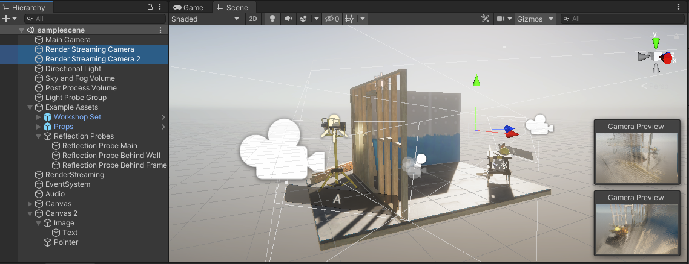

# About Unity Render Streaming

This package contains public APIs and project samples that are built on top of our **Unity Render Streaming**. We can develop a peer-to-peer streaming solution quickly by using this package.

> [!Video https://www.youtube.com/embed/c2pp_T5xzeU]

## Main features

This package provides the main features below.

- Video streaming
- Audio streaming
- Remote control

### Video streaming

We can broadcast video rendered on Unity to browsers via network. For example, It can show the video rendered with HDRP on the browser on the iPad. In addition, broadcasting from multiple cameras is supported.

### Audio streaming
This package enables streaming sounds generated on Unity. And it can cast to multi-browsers simultaneously.

### Remote control

It's possible to send input messages to Unity from the browser, and sending inputs from multiple browsers is supported. Mouse, keyboard, touch, and gamepad are supported as input devices on the browser.

## Requirements

This version of Render Streaming is compatible with the following versions of the Unity Editor

- **Unity 2020.3**
- **Unity 2021.3**
- **Unity 2022.3**
- **Unity 2023.1**

### Platform

- **Windows** (x64 only)
- **Linux**
- **macOS**  (**Intel** and **Apple Slicon**)
- **iOS**
- **Android** (**ARM64** only. **ARMv7** is not supported)

> [!NOTE]
> This package depends on [the WebRTC package](https://docs.unity3d.com/Packages/com.unity.webrtc@3.0). If you build for mobile platform (iOS/Android), please see [the package documentation](https://docs.unity3d.com/Packages/com.unity.webrtc@3.0/manual/requirements.html#additional-notes) to know the requirements for building.

### Browser support

Unity Render Streaming supports almost all browsers that can use WebRTC.

| Browser | Windows | Mac | iOS | Android |
| ------- | ------- | --- | --- | ------- |
| Google Chrome | :white_check_mark: | :white_check_mark: |    | :white_check_mark: |
| Safari |   | :white_check_mark: | :white_check_mark: |                    |
| Firefox | :white_check_mark: |   |   |   |
| Microsoft edge (Chromium based) | :white_check_mark: |   |   |   |

> [!NOTE]
> It may not work properly on some browsers caused by depending on the status of support about WebRTC.

> [!NOTE]
> In **Safari** and **iOS Safari**, WebRTC features cannot be used with **http**. Instead, **https** must be used.

## Samples

Please check [this page](samples.md).
