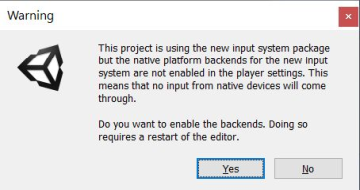

# Installing The Package

Select **Window > Package Manager** in the menu bar.


Check Package Manager window, Click `+` button and select `Add package from git URL...`.


Input the string below to the input field.

```
com.unity.renderstreaming@3.1.0-exp.6
```

The list of version string is [here](https://github.com/Unity-Technologies/UnityRenderStreaming/tags). In most cases, the latest version is recommended to use.

 Click `Add` button, and will start install the package.

If an input system dialog box appears, click `Yes`



## Next Step

After installing the package in the Unity Editor, you can launch the web application for signaling. Please see the next page [Launching The Web Application](launch-webapp.md).
