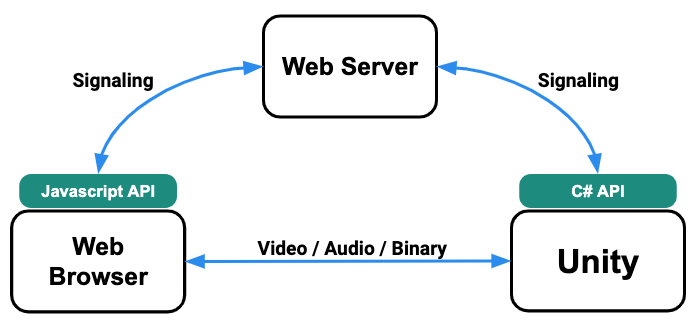
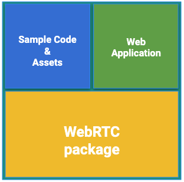
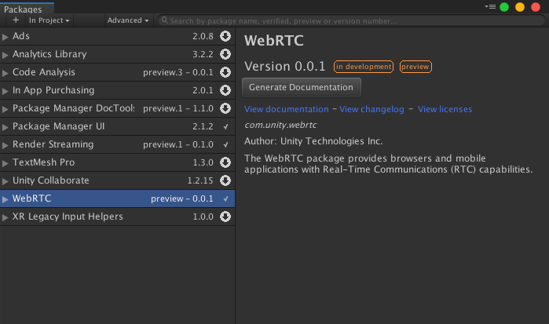

# 概要

Unity Render Streaming のシステムの概観について説明します。

### システム構成

Unity Render Streaming のシステムは以下の 3 つで構成されます。

- **Unity** （エディターもしくはアプリケーション）
- **Web サーバー**
- **Web ブラウザー**

Unity Render Streaming では、**Unity** と **Web ブラウザー** が P2P ネットワークを構成し、UDP/IP を利用して通信を行います。**Web サーバー** は Web ブラウザーと Unity の情報のやり取りを仲介します。この情報のやり取りのことを **シグナリング(signaling)** と呼びます。
シグナリングによってピア間の通信経路が確立され、映像や音声、テキストやバイナリデータを相互にやり取りすることができるようになります。

> [!WARNING]
> 現在、以下の機能に対応していません。
>
> - ブラウザーから Unity へのビデオ送信
> - ブラウザーから Unity へのオーディオ送信

### シグナリング処理の流れ

Unity Render Streaming におけるシグナリング処理の流れを説明します。

1. Web ブラウザーから Web サーバーに **Offer SDP** を送信します。
2. Unity から Web サーバーに問い合わせて、未処理の **Offer SDP** を取得します。
3. Unity から Web サーバーに **Answer SDP** を送信します。
4. Web ブラウザーから Web サーバーに問い合わせて、未処理の **Answer SDP** を取得します。
5. Web ブラウザーから Web サーバーに **ICE Candidate** を送信します。
6. Unity から Web サーバーに問い合わせて、未処理の **ICE Candidate** を取得します。
7. Unity から Web サーバーに **ICE Candidate** を送信します。
8. Web ブラウザーから Web サーバーに問い合わせて、未処理の **ICE Candidate** を取得します。

### パッケージの構成

Unity Render Steraming パッケージは、以下の3つのコンポーネントで構成されています。

- **WebRTC パッケージ**
- **サンプルコード / アセット**
- **ウェブアプリケーション**

### WebRTC パッケージ

**WebRTC** の C# API を提供します。
このパッケージは、Unity Render Streaming パッケージとは独立したパッケージとして管理されています。
詳細は [WebRTC パッケージ](https://docs.unity3d.com/Packages/com.unity.webrtc@latest/manual/jp/index.html) のドキュメントを確認してください。

### サンプルコード / アセット

HDRP/URP テンプレートのサンプルに、 Unity Render Streaming を組み込んだプロジェクトです。

### Web アプリケーション

クライアントサイド及びサーバーサイドのサンプルを含みます。また、シグナリングサーバーの機能を提供しています。Web アプリケーションの詳細については[ドキュメント](webapp.md)を参照してください。
