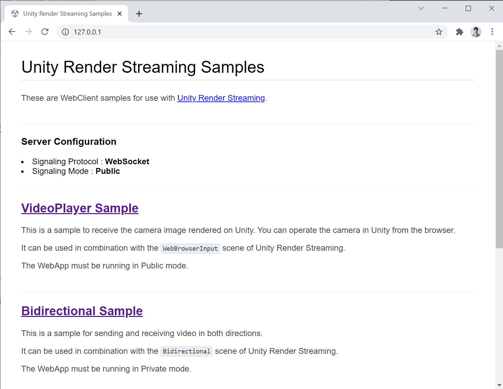

# Launching The Web Application

After installing the package, you will need to install and run the signaling server. If you want to learn about signaling, you can see [this page](overview.md).

## Download web application

Click on **Edit > Render Streaming > Download web app** menu  item on Unity Editor to download the application.
The download site is [this page](https://github.com/Unity-Technologies/UnityRenderStreaming/releases).


When the select download folder window appears, click on `Select Folder` to download the file to the default folder


## Run command on terminal

After the download is finished and a `powershell` or `cmd` window is opened, and run `webserver.exe` with `-w` option. Please refer to [this page](webapp.md) for commandline options.

```
.\webserver.exe
```

You can see logs on the commandline like below.


### Launch server on Linux or macOS

If you use it on **macOS** or **Linux**, please run the command below to give the execute permission.

```
# for Linux
chmod a+x ./webserver

# for macOS
chmod a+x ./webserver_mac
```

### Checking on browser

To check if the web server is up and running, access it from your browser. Basically, any modern browser will work. Access `http://localhost` from your browser. If the web page is displayed as shown below, there is no problem.



## Next Step

You downloaded the web application and launched it. This application can be freely modified by developers. To get the source code, please visit the [GitHub repository](https://github.com/Unity-Technologies/UnityRenderStreaming).

Then, the web application also provides some useful command options. If you want more detailed information, please refer to [the web application page](webapp.md).

The next step is to work on the Unity project. Go to the [Creating The Scene](create-scene.md) page.
