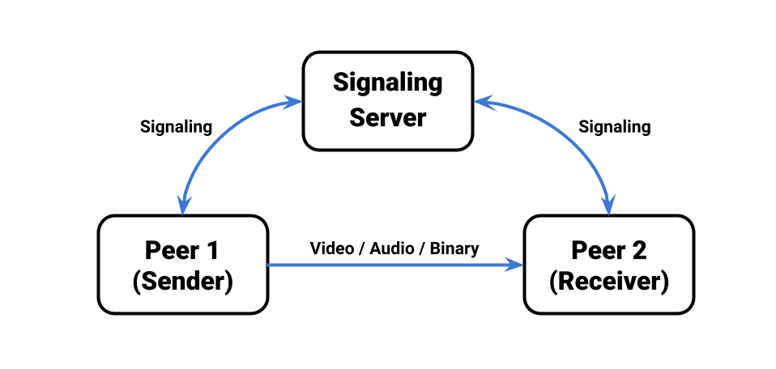
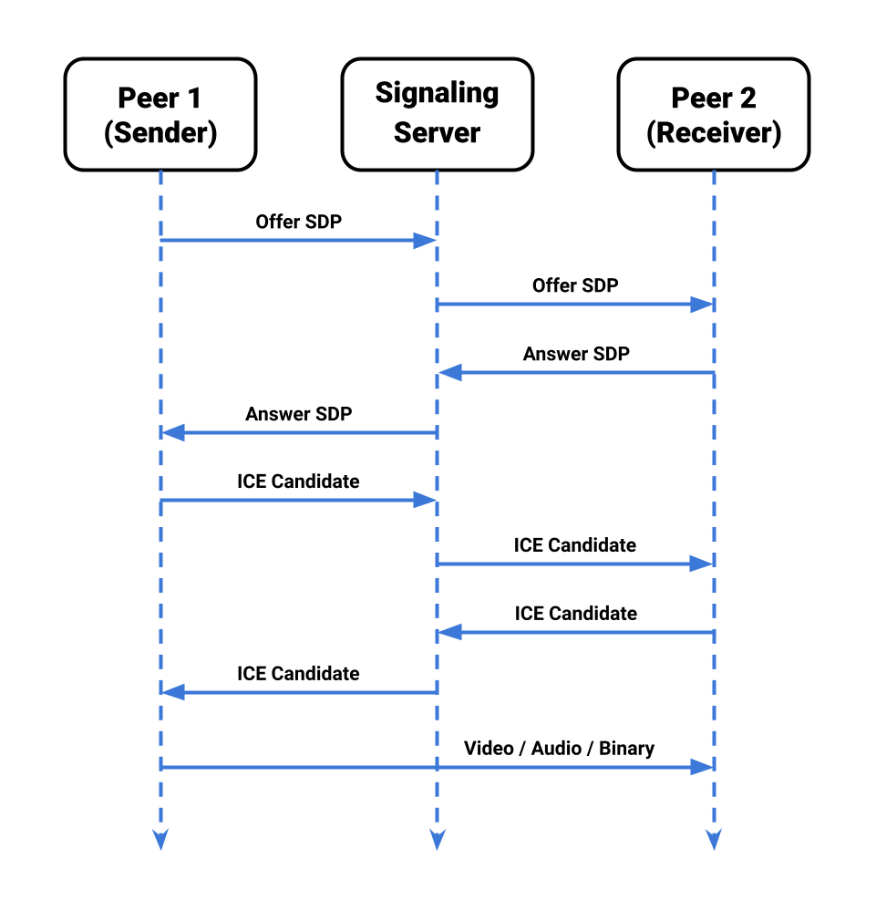

# Overview

The following is an explanation the general concepts of the Unity Render Streaming system. 

## System Structure

The Render Streaming system consists of the following 3 components.

- **Signaling server**
- **Peer 1 (Sender)**
- **Peer 2 (Receiver)**

In Render Streaming a P2P network is created between two peers, and this network sends video/audio/binary data. The **Web server** enables communication between two peers. This communication is called **signaling**. 

## The Signaling Process

The following is an explanation of how signaling works. 

1. *Peer 1* sends **Offer SDP** to *Signaling Server*.
2. The *Peer 2* checks the *Signaling Server* for unprocessed **Offer SDPs** and receives any found.
3. The *Peer 2* sends **Answer SDP** to the *Signaling Server*.
4. The *Peer 1* checks the *Signaling Server* for unprocessed **Answer SDPs** and receives any found.
5. The *Peer 1* sends **ICE Candidate** to the *Signaling Server*.
6. The *Peer 2* checks the *Signaling Server* for unprocessed **ICE Candidates** and receives any found.
7. The *Peer 2* sends **ICE Candidate**to the *Signaling Server*.
8. The *Peer 1* checks the *Signaling Server* for unprocessed **ICE Candidate** and receives any found.
9. The connection establishment between peers are completed and *Peer 1* can send streams to the *Peer 2*.