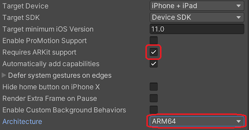
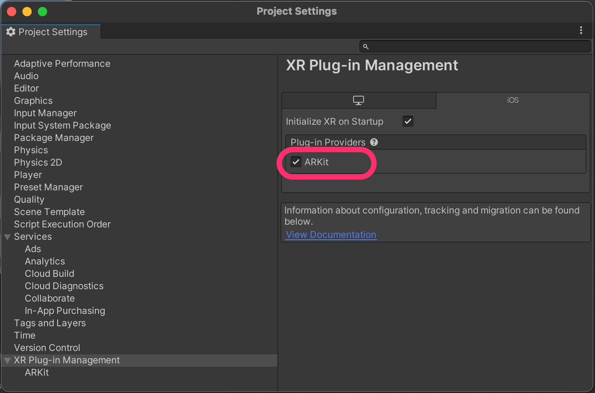
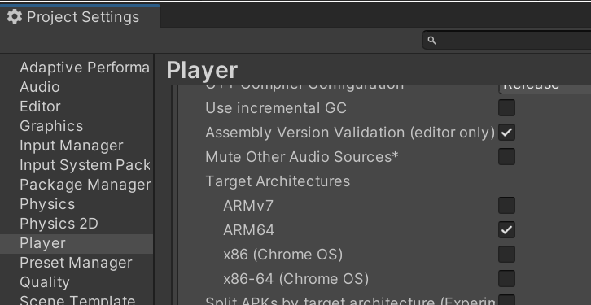
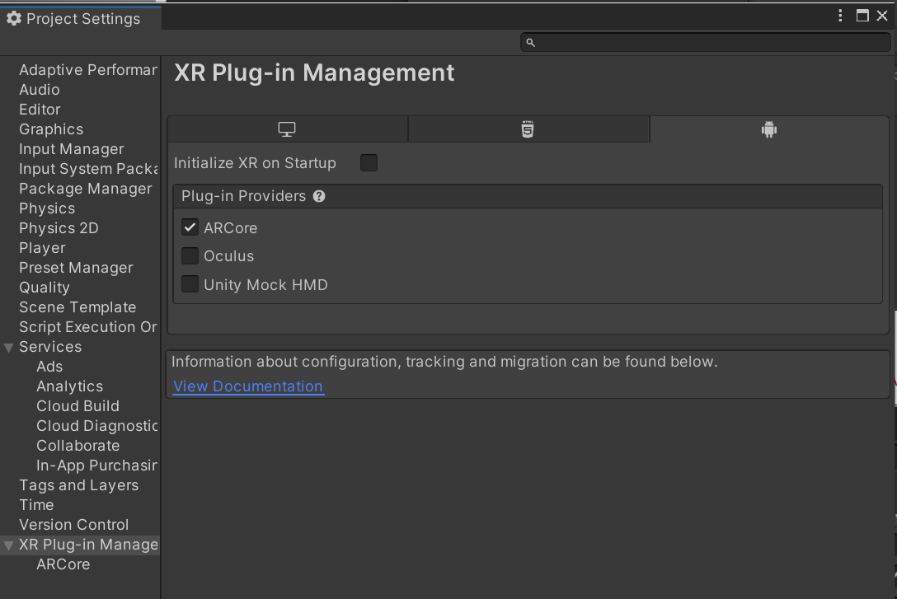
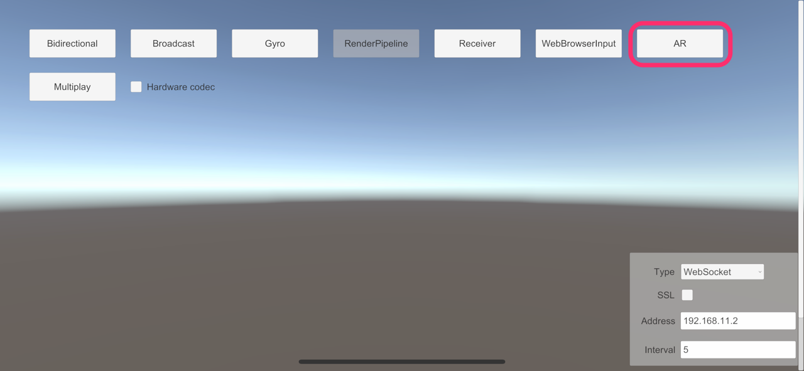
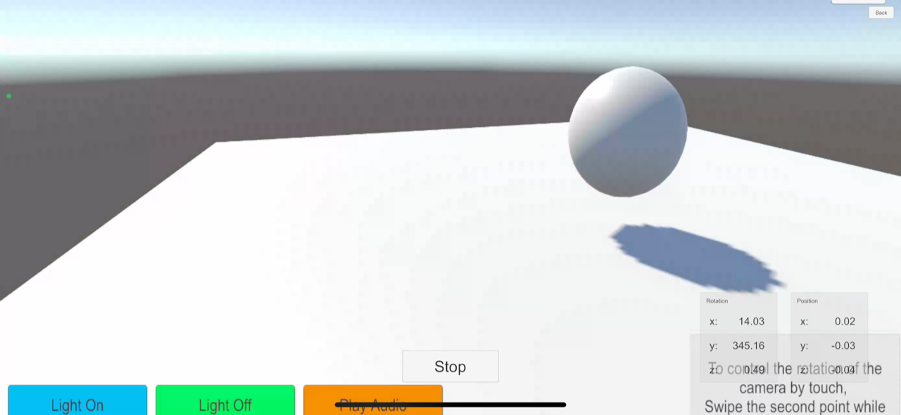

# AR Foundation Sample

This sample demonstrates operating the position and direction of a camera on another PC from the mobile device supported by [AR Foundation](https://docs.unity3d.com/Packages/com.unity.xr.arfoundation@latest).

> [!NOTE]
> If no codec is available on both sender and receiver, the video can not stream. Please note that the compatibility of codecs is different corresponding to platforms and graphics API.

## Additional packages

To use this sample, You need to install following additional packages.

- [AR Foundation](https://docs.unity3d.com/Packages/com.unity.xr.arfoundation@latest)
- [XR Plugin Management](https://docs.unity3d.com/Packages/com.unity.xr.management@latest)

> [!NOTE]
> Please check the item *Requirements* in the manual to know the package version which is compatible with your Unity Editor.

Moreover, you need to install each *XR plugin* package depending on the platform.
​
| Platform | packages |
| -------- | -------- |
| iOS      | [ARKit XR Plugin](https://docs.unity3d.com/Packages/com.unity.xr.arcore@latest) |
| Android  | [ARCore XR Plugin](https://docs.unity3d.com/Packages/com.unity.xr.arkit@latest) |

## Build settings

### iOS

In case of iOS, Please enable to `Requires ARKit support` on `Player Settings`. Additionally, `Architecture` should be selected `ARM64`.

Open **Project Settings** window and select **XR Plug-in Management**. Set enable `ARKit` option in iOS tab.

### Android

In case of Android, **Target Architectures** should be checked `ARM64`, and not checked `ARMv7`.

Open **Project Settings** window and select **XR Plug-in Management**. Set enable `ARCore` option in Android tab.

## Usage

### Procedure

1) Launch the signaling server using public mode. Please refer to [this link](webapp.md) for launching.

2) Build an app in Unity Editor, and launch an application on mobile device.

3) Open **Menu** scene in Unity Editor and click **Broadcast** button.

4) On mobile device, configure signaling settings, and click `AR` button.

5) Push the `Start` button on the device and check streaming video.

