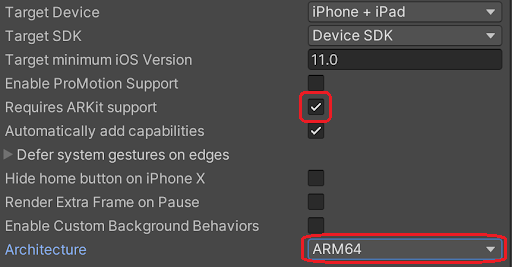

# AR Foundation Sample

This sample demonstrates operating the position and direction of a camera on another PC from the mobile device supported by [AR Foundation](https://docs.unity3d.com/Packages/com.unity.xr.arfoundation@latest).

> [!NOTE]
> In this version, it was checked on only iOS devices. Android and other devices are not supported by this sample.

> [!NOTE]
> If no codec is available on both sender and receiver, the video can not stream. Please note that the compatibility of codecs is different corresponding to platforms and graphics API.

## Sample scenes

There are two scenes in this sample because the verified package version of AR Foundation is different depends on Unity version.

| Unity version | scene name    |
| ------------- | ------------- |
| Unity2019.4   | `ARFoundation2.1` |
| Unity2020.2   | `ARFoundation4.0` |

## Additional packages

To use this sample, You need to install additional packages shown following table.

| Unity version | Platform | packages |
| ------------- | -------- | -------- |
| Unity2019.4   | iOS      | `ARFoundation 2.1` |
| Unity2020.2   | iOS      | `ARFoundation 4.0` |

In addition, depending on the platform, each `XR plugin` package must be installed.
​
| Unity version | Platform | packages |
| ------------- | -------- | -------- |
| Unity2019.4   | iOS      | `ARKit XR Plugin 2.1` |
| Unity2019.4   | Android  | `ARCore XR Plugin 2.1` |
| Unity2020.2   | iOS      | `ARKit XR Plugin 4.0` |
| Unity2020.2   | Android  | `ARCore XR Plugin 4.0` |

> [!NOTE]
> In this version, Android is not supported by this sample.

## Build settings

### iOS

In case of iOS, Please enable to `Requires ARKit support` on `Player Settings`. Additionally, `Architecture` should be selected `ARM64`.

### Android

In this version, Android is not supported by this sample.

## Usage

### Hardware acceleration 

Recommend enabling `Hardware Encoder support` on the `Render Streaming` inspector to improve performance using hardware acceleration.

### Procedure

1) Launch the signaling server using public mode. Please refer to [this link](webapp.md) for launching.

2) Open scene `ARFoundation2.1` or `ARFoundation4.0`, and specify IP address of the signaling server to the `Signaling URL` parameter on the inspector.

3) Specify the build platform (Currently iOS supported only) and start building. Connect the device to the PC, and transfer the application to the device.

4) Open `Broadcast` scene and Specify IP address of the signaling server to the `Signaling URL` parameter on the inspector.

5) Click on the Play button in Unity Editor.

6) Push the `Play` button on the device and check streaming video.