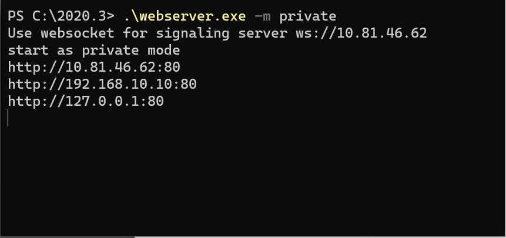
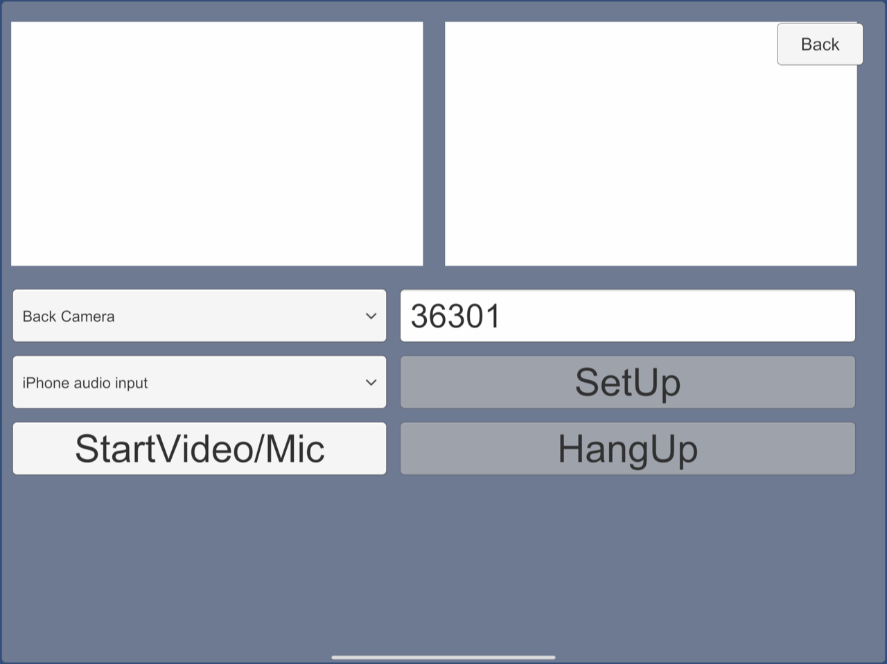
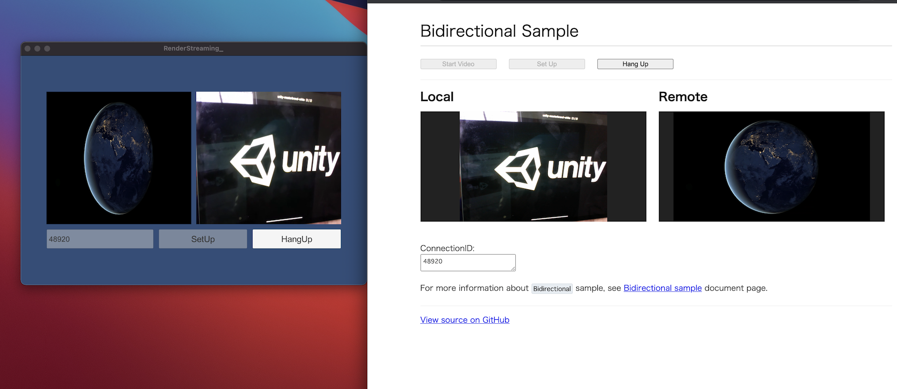

# Bidirectional Sample

This is a sample of bi-directional(send/receive) each other's video.

It works with Unity-Unity or Unity-Browser combination.

> [!NOTE]
> If no codec is available on both sender and receiver, the video can not stream. Please note that the compatibility of codecs is different corresponding to platforms and graphics API.

## Usage

### Procedure (Unity-Unity)

1) Launch the signaling server using **private mode**. Please refer to [this link](webapp.md) for launching.

> [!NOTE]
> This sample does not work on signaling server in public mode.

2) Build an app in Unity Editor, and launch an application.

3) Click `Bidirectional` button on the app.

4) Build and run application. Select video/audio devices and click `StartVideo/Mic` button. Then click `SetUp` button. (**ConnectionID** is autofill.)

> [!NOTE]
> When building application for iOS platform, you need set `Camera Usage Description` on Player Settings.
> If not set this, your application exits. (refer [this page](https://developer.apple.com/library/archive/documentation/General/Reference/InfoPlistKeyReference/Articles/CocoaKeys.html#//apple_ref/doc/uid/TP40009251-SW24))

5) Enter same **ConnectionID** on the application in Unity Editor.

6) Press the `SetUp` button in Unity Editor.

7) You can see streaming video each other's. (Of course, it also works with Unity applications.)

### Procedure (Unity-Browser)

1.~3. steps same as Unity-Unity Procedure.

4) Open your web browser and access `http://localhost`. You can see the top page. Click a `Bidirectional Sample` link.

5) Enter same **ConnectionID** on the Unity Application to Browser text area.

6) Click `StartVideo` button, after that click `SetUp` button in Browser.

7) You can see streaming video each other's.

