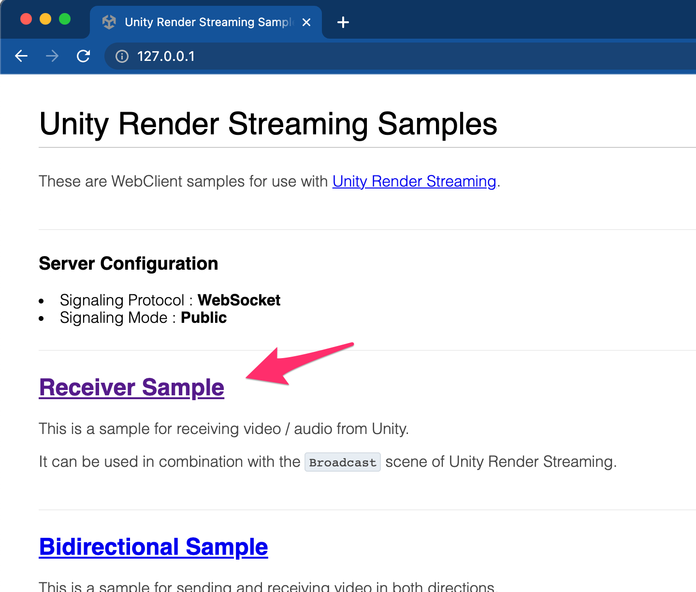
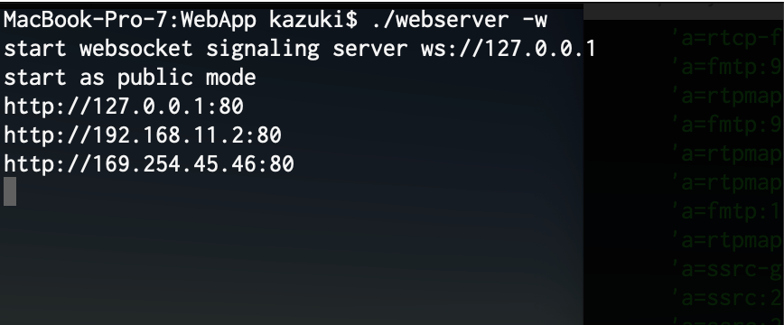
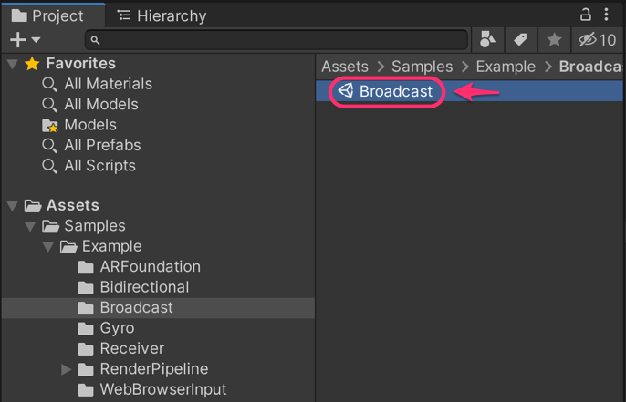
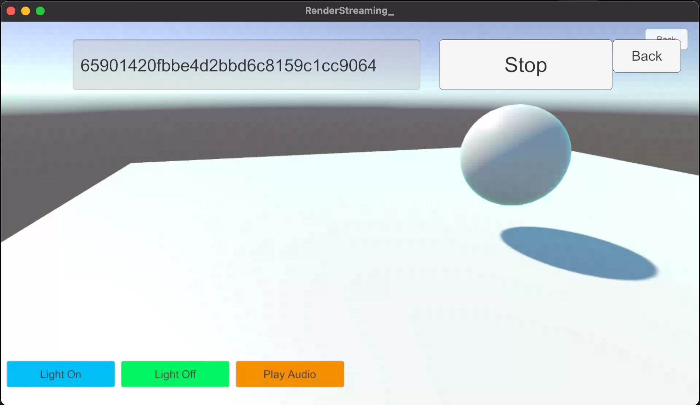

# Broadcast Sample

The **Broadcast** sample can stream video and audio to multi Unity applications.

This sample can use in combination with other samples below.

- [AR Foundation Sample](sample-arfoundation.md)
- [Gyroscope Sample](sample-gyroscope.md)
- [Receiver Sample](sample-receiver.md)

This sample can also use in combination with browser `Receiver` sample.

This sample uses build-in render pipeline. If you want to try [High-Definition Render pipeline](https://docs.unity3d.com/Packages/com.unity.render-pipelines.universal@latest) or [Universal Render Pipeline](https://docs.unity3d.com/Packages/com.unity.render-pipelines.universal@latest), please try [Render Pipeline Sample](sample-renderpipeline.md).

## Usage

### Procedure

1) Launch the signaling server using public mode. Please refer to [this link](webapp.md) for launching.

2) Build an app in Unity Editor, and launch an application.

3) Click **Broadcast** scene on the app.

5) Open **Menu** scene and click on the Play button in Unity Editor.

6) Click `Receiver` button on the app.

7) Click `Start` button.

