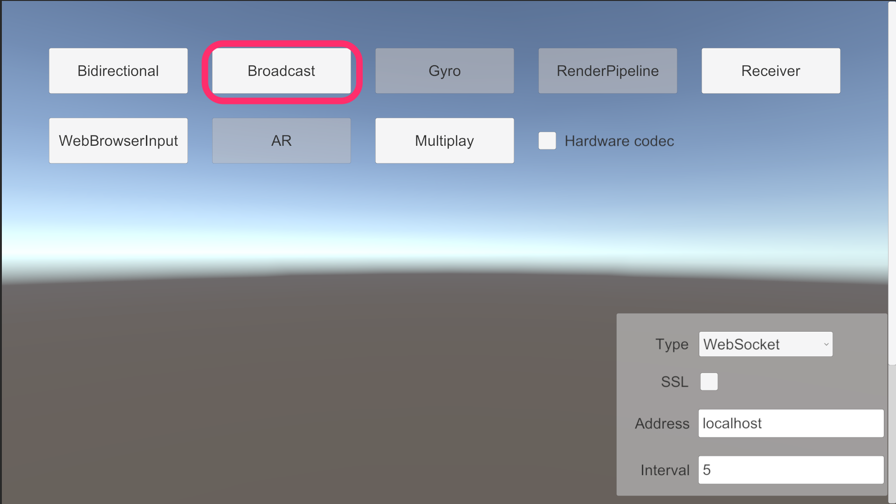

# Broadcast Sample

The `Broadcast` sample can stream video and audio to multi Unity applications.

This sample can use in combination with other samples below.

- [AR Foundation Sample](sample-arfoundation.md)
- [Gyroscope Sample](sample-gyroscope.md)
- [Receiver Sample](sample-receiver.md)

This sample uses build-in render pipeline. If you want to try [High-Definition Render pipeline](https://docs.unity3d.com/Packages/com.unity.render-pipelines.universal@latest) or [Universal Render Pipeline](https://docs.unity3d.com/Packages/com.unity.render-pipelines.universal@latest), please try [Render Pipeline Sample](sample-renderpipeline.md).

## Usage

### Hardware acceleration

Recommend enabling `Hardware Encoder support` on the `Render Streaming` inspector to improve performance using hardware acceleration.

### Procedure

1) Launch the signaling server using public mode. Please refer to [this link](webapp.md) for launching.

2) Build a scene as a receiver (ex. [`Receiver`](sample-receiver.md) scene) in Unity Editor, and launch an application.

3) Open `Broadcast` scene.

4) Specify IP address of the signaling server to the `Signaling URL` parameter on the inspector.

5) Click on the Play button in Unity Editor.

6) Operate the receiver and check the streaming video/audio correctly.
