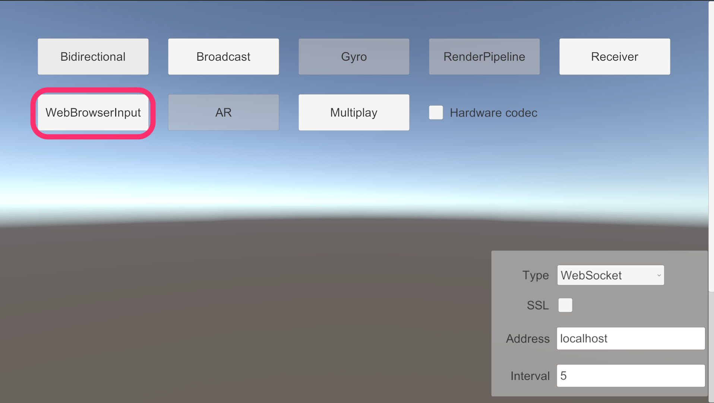
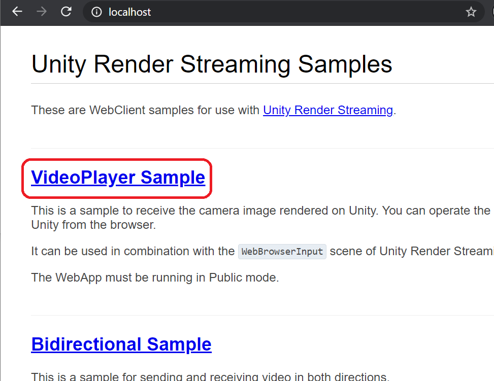
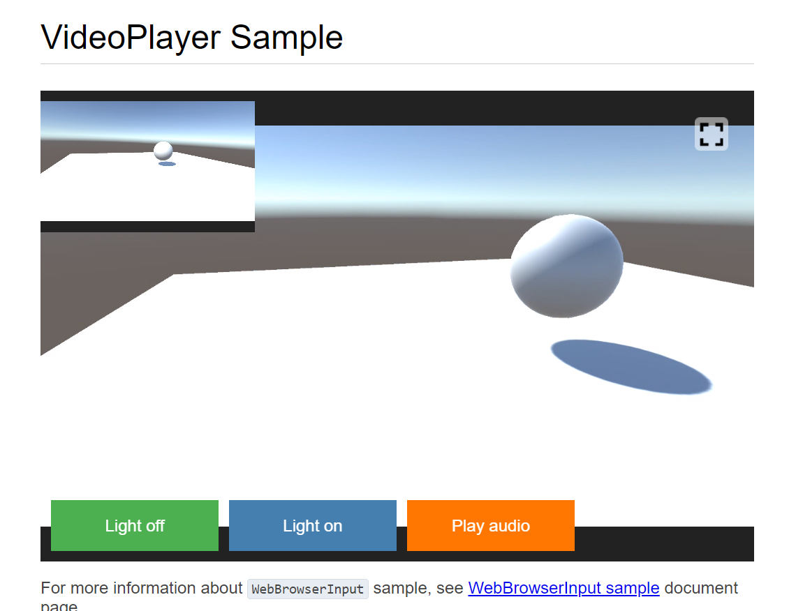

# Web Browser Input Sample

This sample demonstrates to stream the video from Unity to the web browser, and operate input events on the browser as Unity events.

you can see the list of supported browsers on [The Web Application](webapp.md) page.

## Usage

### Hardware acceleration 

Recommend enabling `Hardware Encoder support` on the `Render Streaming` inspector to improve performance using hardware acceleration.

### Procedure

1) Launch the signaling server using public mode. Please refer to [this link](webapp.md) for launching.

2) Open `WebBrowserInput` scene.

3) Specify IP address of the signaling server to the `Signaling URL` parameter on the inspector.

4) Click on the Play button in Unity Editor.

5) Open your web browser and access `http://localhost`. You can see the top page. Click a `VideoPlayer Sample` link.

6) You can see the Unity scene on the browser, and control a camera in the Unity scene.

