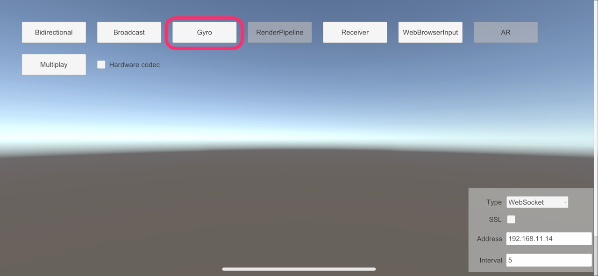
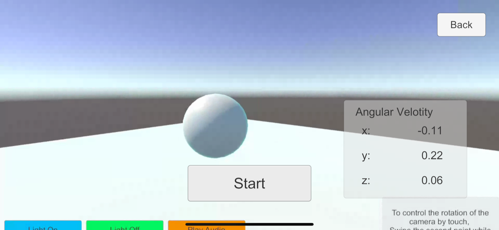

# Gyroscope Sample

This sample shows ways to operate the direction of a camera on the remote PC from the mobile device that equipped gyro sensor.

## Usage

### Procedure

1) Launch the signaling server using public mode. Please refer to [this link](webapp.md) for launching.

2) Build an app in Unity Editor, and launch an application on mobile device.

3) Open **Menu** scene in Unity Editor and click **Broadcast** button.

4) On mobile device, configure signaling settings, and click **Gyro** button.

5) Push the **Start** button on the device and check streaming video.

