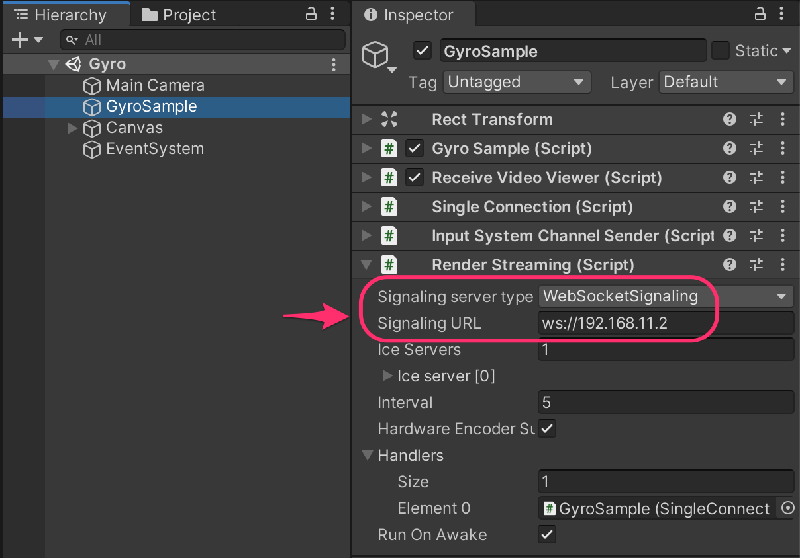
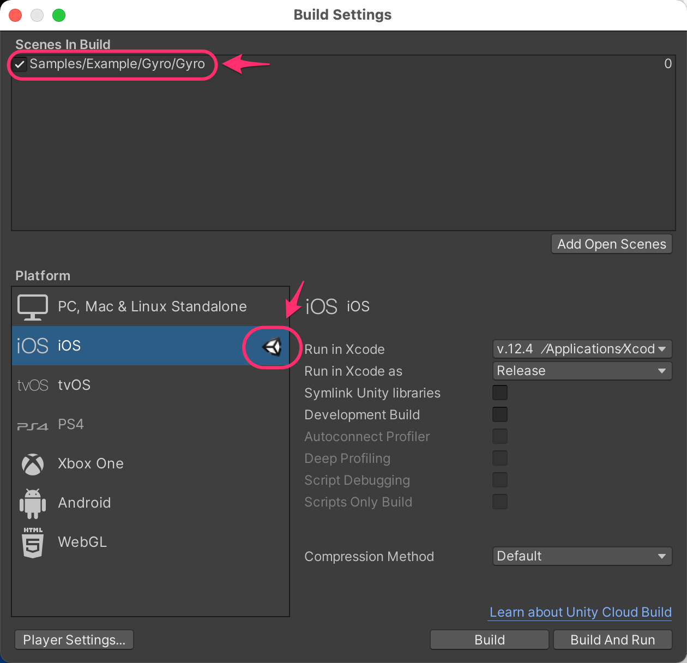

# Gyroscope Sample

This sample shows ways to operate the direction of a camera on the remote PC from the mobile device that equipped gyro sensor.

> [!NOTE]
> In this version, it was checked on only iOS devices. Android and other devices are not supported by this sample.

> [!NOTE]
> If no codec is available on both sender and receiver, the video can not stream. Please note that the compatibility of codecs is different corresponding to platforms and graphics API.

## Usage

### Hardware acceleration 

Recommend enabling `Hardware Encoder support` on the `Render Streaming` inspector to improve performance using hardware acceleration.

### Procedure

1) Launch the signaling server using public mode. Please refer to [this link](webapp.md) for launching.

2) Open `Gyro` scene and specify IP address of the signaling server to the `Signaling URL` parameter on the inspector.

3) Specify the build platform (Currently iOS supported only) and start building. Connect the device to the PC, and transfer the application to the device.

4) Open `Broadcast` scene and Specify IP address of the signaling server to the `Signaling URL` parameter on the inspector.

5) Click on the Play button in Unity Editor.

6) Push the `Play` button on the device and check streaming video.