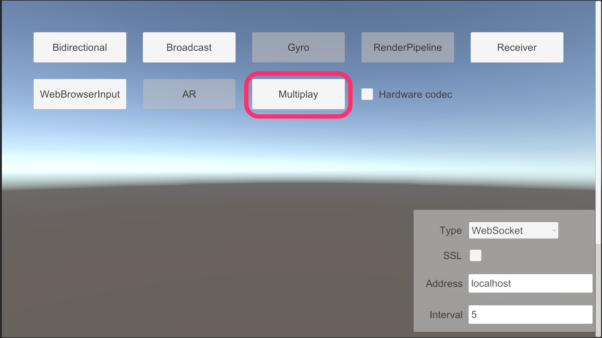
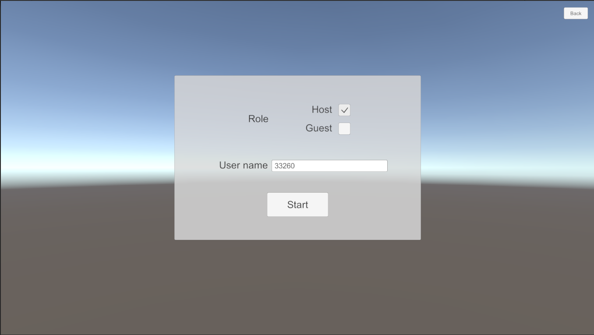
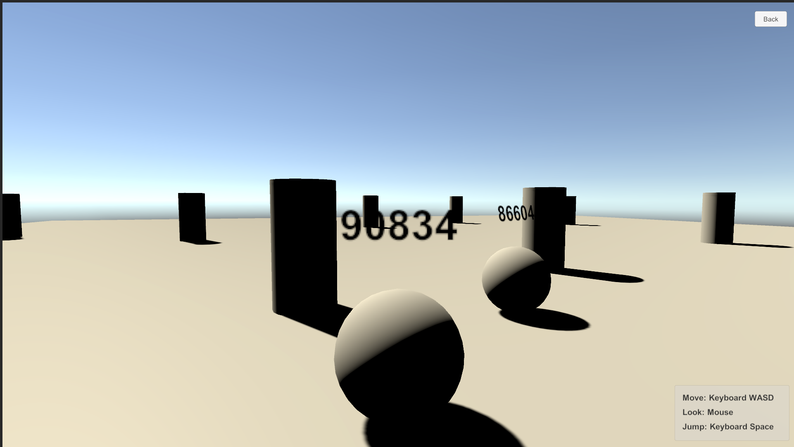

# Multiplay Sample

The `Multiplay` sample can stream video and audio to multi Unity applications. This sample works with the combination of Unity-Unity or Unity-Browser.

## Usage

### Procedure

1) Launch the signaling server using public mode. Please refer to [this link](webapp.md) for launching.

2) Build an app in Unity Editor, and launch an application.

3) Click `Multiplay` button on the app.

4) Select **host** option and click `Start` button.

5) Click on the Play button in Unity Editor, and click `Multiplay` button.

6) Select **guest** option and click `Start` button.

7) Displayed same scene each screens.

