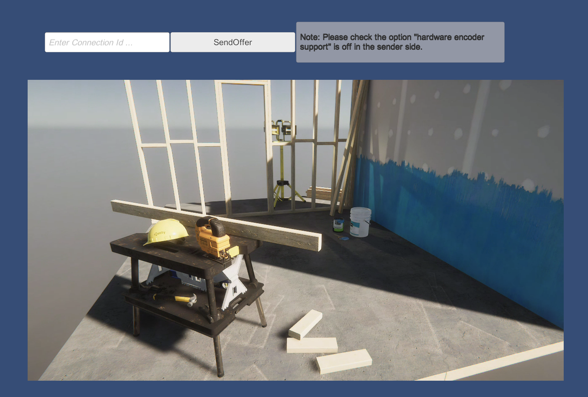

# Receiver Sample

This sample shows that displaying a video streamed from another Unity.

This sample can use in combination with the [Broadcast](sample-broadcast.md) sample.

> [!NOTE]
> If no codec is available on both sender and receiver, the video can not stream. Please note that the compatibility of codecs is different corresponding to platforms and graphics API.

## Usage

### Procedure

This procedure is for using it with the [Broadcast](sample-broadcast.md) sample.

1) Launch the signaling server using public mode. Please refer to [this link](webapp.md) for launching.

2) Build an app in Unity Editor, and launch an application.

3) On the Unity Editor, open **Menu** scene and click **Broadcast** button.

4) Click `Receiver` button on the app.

6) Click `Start` button.

