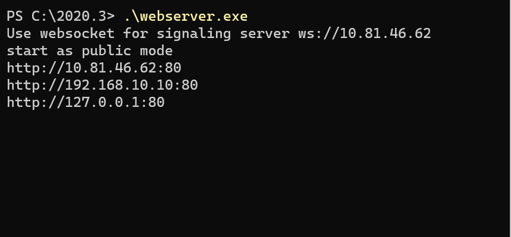

# RenderPipeline sample

This samples can stream video and audio to multi Unity applications using [High-Definition Render pipeline](https://docs.unity3d.com/Packages/com.unity.render-pipelines.universal@latest) or [Universal Render Pipeline](https://docs.unity3d.com/Packages/com.unity.render-pipelines.universal@latest).

This sample can use in combination with other samples below.

- [AR Foundation Sample](sample-arfoundation.md)
- [Gyroscope Sample](sample-gyroscope.md)
- [Receiver Sample](sample-receiver.md)

## Additional packages

To use this sample, You need to install additional packages shown following table.

### High-Definition Render pipeline

| Unity version | packages |
| ------------- | -------- |
| Unity2019.4   | `High Definition RP 7.x` |
| Unity2020.2   | `High Definition RP 10.x` |

### Universal Render Pipeline

| Unity version | packages |
| ------------- | -------- |
| Unity2019.4   | `Universal RP 7.5.x` |
| Unity2020.2   | `Universal RP 10.3.x` |

## Usage

### Hardware acceleration 

Recommend enabling `Hardware Encoder support` on the `Render Streaming` inspector to improve performance using hardware acceleration.

### Procedure

1) Launch the signaling server using public mode. Please refer to [this link](webapp.md) for launching.

2) Build a scene as a receiver (ex. [`Receiver`](sample-receiver.md) scene) in Unity Editor, and launch an application.

3) Open `HDRP` or `URP` scene, and specify IP address of the signaling server to the `Signaling URL` parameter on the inspector.

4) Click on the Play button in Unity Editor.

5) Operate the receiver and check the streaming video/audio correctly.
