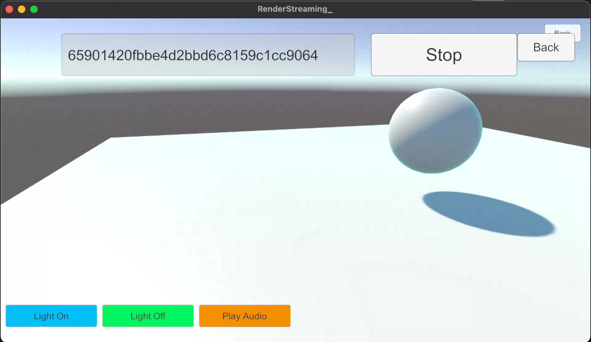

# RenderPipeline sample

This samples can stream video and audio to multi Unity applications using [High-Definition Render pipeline](https://docs.unity3d.com/Packages/com.unity.render-pipelines.universal@latest) or [Universal Render Pipeline](https://docs.unity3d.com/Packages/com.unity.render-pipelines.universal@latest).

This sample can use in combination with other samples below.

- [AR Foundation Sample](sample-arfoundation.md)
- [Gyroscope Sample](sample-gyroscope.md)
- [Receiver Sample](sample-receiver.md)

## Additional packages

To use this sample, You need to install additional packages shown following table.

### [High-Definition Render pipeline](https://docs.unity3d.com/Packages/com.unity.render-pipelines.high-definition@15.0/manual/index.html)

Please see [Unity Editor compatibility](https://docs.unity3d.com/Packages/com.unity.render-pipelines.high-definition@15.0/manual/System-Requirements.html#unity-editor-compatibility) in the HDRP manual.

### [Universal Render Pipeline](https://docs.unity3d.com/Packages/com.unity.render-pipelines.universal@15.0/manual/index.html)

Please see [Unity Editor compatibility](https://docs.unity3d.com/Packages/com.unity.render-pipelines.universal@15.0/manual/requirements.html#unity-editor-compatibility) in the URP manual.

## Usage

### Procedure

1) Launch the signaling server using public mode. Please refer to [this link](webapp.md) for launching.

2) Build an app in Unity Editor, and launch an application.

3) On the Unity Editor, open **Menu** scene and click `RenderPipeline` button.

4) Click `Receiver` button on the app.

6) Click `Start` button.

